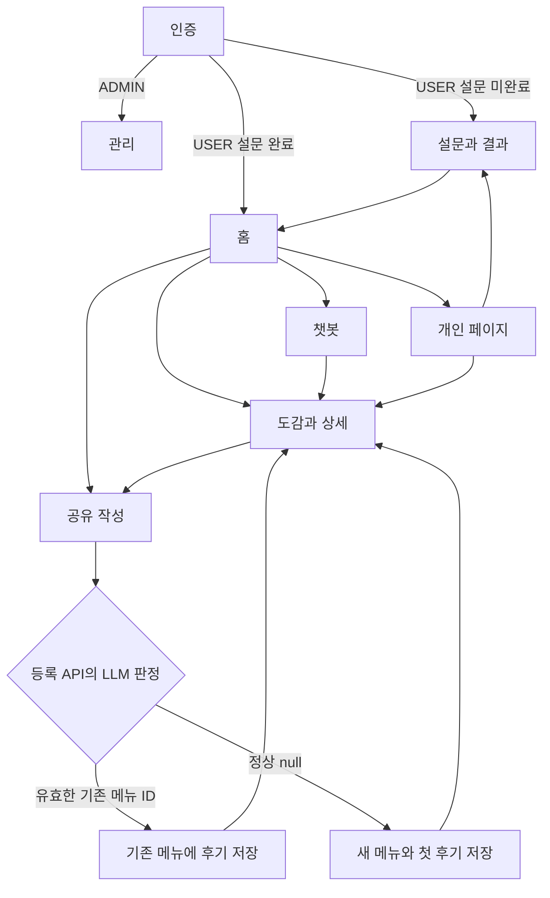

# 3단계. Screen List와 전체 User Flow

작성자: 7반 이민형 | 버전: 0.3.1 | 기준: 현재 프로젝트 기술서 초안_v2.md

## 화면 목록

| 번호 | 화면 ID | 화면명 | Depth 경로 | 관련 요구사항 ID |
| --- | --- | --- | --- | --- |
| 1 | SCR-AUTH-001 | 인증 | /login | REQ-FUNC-001, REQ-FUNC-002 |
| 2 | SCR-SURVEY-001 | 취향 설문과 결과 | /preferences | REQ-FUNC-003, REQ-FUNC-004, REQ-FUNC-007 |
| 3 | SCR-HOME-001 | 홈 | / | REQ-FUNC-005, REQ-FUNC-006, REQ-FUNC-007, REQ-FUNC-012, REQ-FUNC-014 |
| 4 | SCR-CATALOG-001 | 도감과 메뉴 상세 | /menus, /menus/:menu_id | REQ-FUNC-007, REQ-FUNC-008, REQ-FUNC-009, REQ-FUNC-013 |
| 5 | SCR-SHARE-001 | 메뉴와 후기 공유 | /share | REQ-FUNC-010, REQ-FUNC-011, REQ-FUNC-012, REQ-FUNC-013 |
| 6 | SCR-ME-001 | 개인 페이지 | /me | REQ-FUNC-001, REQ-FUNC-002, REQ-FUNC-003, REQ-FUNC-009, REQ-FUNC-014, REQ-FUNC-015 |
| 7 | SCR-CHAT-001 | 음료 추천 챗봇 | /recommendations/chat | REQ-FUNC-006, REQ-FUNC-007 |
| 8 | SCR-ADMIN-001 | 서비스 관리 | /admin | REQ-FUNC-016, REQ-FUNC-017, REQ-FUNC-018 |

## 성공 흐름

## 실패 흐름

- LLM 실패, 잘못된 출력, 비교 대상 밖 ID → 등록하지 않고 입력 유지 → 수동 재시도.
- 최초 선호 조회 404 → 빈 설문. 추천 실패 → 설문 응답 유지 → 재시도 또는 도감 탐색.
- 영수증 실패 또는 만료 → 작성 내용 유지 → 재확인.
- 등록 응답 유실 → 자동 재등록 금지 → 개인 페이지에서 생성된 후기 확인.
- 세션 만료 → 로그인 후 역할과 설문 상태를 먼저 분기.
- 대표 사진 삭제 → 메뉴 상세 기본 이미지 표시.

## 공통 예외 정책

| 상태 | 발생 조건 | 화면 처리 | HTTP 코드 |
| --- | --- | --- | --- |
| 입력 오류 | 형식, 필수값, 범위 위반 | 해당 필드에 안내, 입력 유지 | 400 |
| 미인증 | 세션 만료 | 로그인 이동, 파일은 다시 선택 | 401 |
| 권한 없음 | 역할, 소유권 또는 CSRF 실패 | 작업 차단, CSRF는 재발급 후 수동 재시도 | 403 |
| 데이터 없음 | 단일 리소스 없음 | 화면별 복귀 또는 최초 입력 처리 | 404 |
| 빈 결과 | 목록 또는 추천 후보 없음 | 빈 상태와 도감 이동 | 200 |
| 충돌 | 이메일/브랜드 중복 또는 관리자 삭제 제한 | 대상과 원인 안내 | 409 |
| 파일 오류 | 크기 또는 파일 형식 위반 | 파일 교체 | 413 / 415 |
| 영수증 확인 실패 | 브랜드 불일치, 만료 또는 소비된 인증 | 입력 유지, 영수증 재확인 | 422 |
| AI 출력 오류 | JSON 파싱 실패, 비교 대상 밖 메뉴 ID | 등록하지 않음, 입력 유지, 수동 재시도 | 502 |
| 외부 장애 | LLM 또는 구글 장애 | 입력 유지, 재시도 안내 | 503 |
| 시간 초과 | 요청 시간 한도 초과 | 로딩 해제, 재시도 안내 | 504 |
| 서버 오류 | 처리 중 예기치 않은 예외 | 내부 오류 비노출 | 500 |

## 자체 검토

이메일과 구글 로그인 모두 역할과 설문 상태를 같은 기준으로 분기한다. 등록은 기존 메뉴 연결과 새 메뉴 생성 모두 같은 요청의 성공 결과이며, 동일 메뉴 발견을 사용자 확인 오류로 취급하지 않는다.
