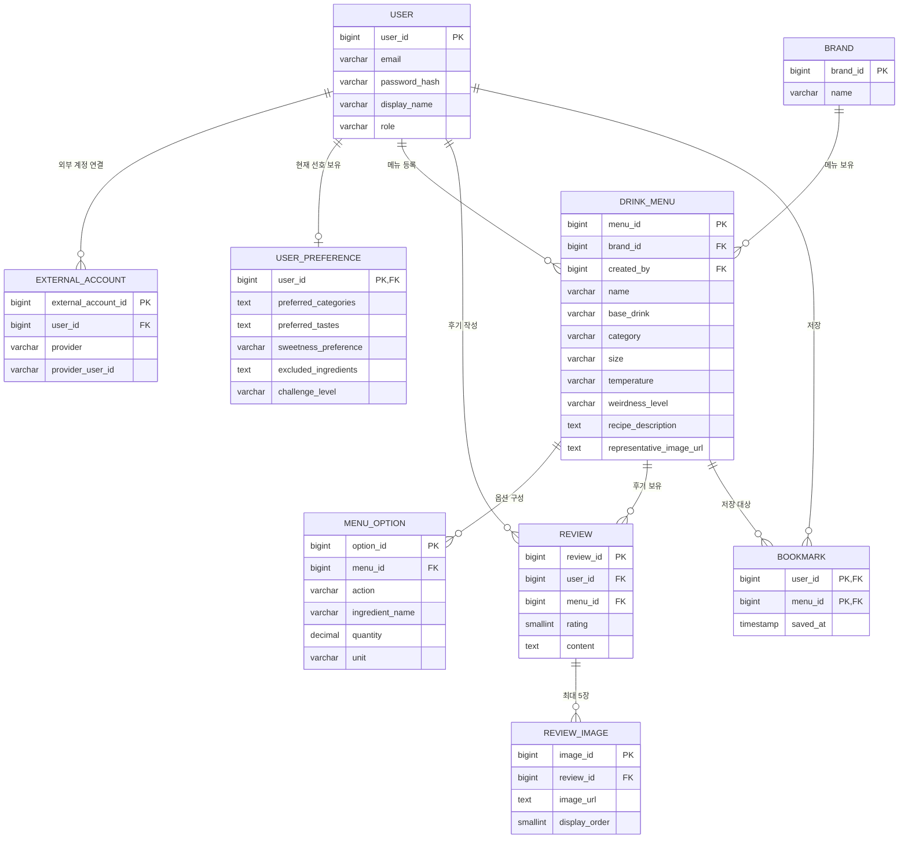

# 프로젝트 기술서

## 기본 정보

| 항목              | 작성 내용                                                                                                      |
| ----------------- | -------------------------------------------------------------------------------------------------------------- |
| 반                | 7반                                                                                                            |
| 이름              | 이민형                                                                                                         |
| 프로젝트명        | 괴식도감                                                                                                       |
| 서비스 한 줄 소개 | 색다른 카페 음료를 찾는 사용자가 자신의 취향에 맞는 조합을 추천받고, 경험한 음료를 기록하고 공유하는 웹 서비스 |

---

# 1. 서비스 개요

## 1.1. 서비스 이름

- **서비스명:** 괴식도감
- **이름의 의미:** 독특한 음료 조합을 뜻하는 ‘괴식’과 조합을 모아 다시 찾아보는 ‘도감’을 결합했다.
- **서비스에서 다루는 괴식의 범위:** 카페에서 주문해 마실 수 있는 독특한 음료 조합을 대상으로 한다.

## 1.2. 서비스 목적과 배경

### 1. 서비스가 필요한 상황

색다른 카페 음료를 찾는 사용자는 새로운 조합을 탐색하는 데 시간이 들고, 이전에 주문한 조합과 매장을 기억하기 어렵다.

음료 정보가 여러 사이트와 개인 메모에 흩어져 있어, 새 조합을 찾거나 이전 음료를 다시 주문할 때 반복해서 검색해야 한다.

괴식도감은 기획자와 지인이 점심시간에 겪은 음료 탐색의 불편에서 시작했다.

### 2. 사용자가 겪는 구체적인 문제

| 구분                  | 내용                                                                      |
| --------------------- | ------------------------------------------------------------------------- |
| 문제를 겪는 사람      | 점심시간이나 쉬는 시간에 독특한 카페 음료를 마시고 싶은 사용자            |
| 문제가 발생하는 상황  | 새로운 음료 조합을 찾거나 이전에 마신 조합을 다시 주문하려는 상황         |
| 기억의 어려움         | 이전에 마신 음료의 조합과 주문한 매장을 기억하기 어려움                   |
| 반복 탐색의 불편      | 음료 조합을 찾기 위해 여러 사이트와 개인 기록을 다시 확인해야 함          |
| 선택의 어려움         | 조합이 얼마나 독특한지, 어떤 맛인지, 자신의 취향에 맞는지 판단하기 어려움 |
| 기획 단계에서 본 원인 | 음료 조합, 맛에 대한 설명, 주문 경험과 후기를 함께 모아 확인하기 어려움   |

### 3. 서비스의 목적

**경험한 음료 조합을 다시 찾고, 새로운 조합을 빠르게 선택하도록 돕는다.**

사용자는 다음과 같은 활동을 할 수 있다.

- 사전 취향 조사를 바탕으로 자신에게 맞는 음료 조합을 추천받는다.
- 다른 사용자가 경험한 음료 조합과 후기를 확인한다.
- 음료의 이미지, 맛의 성향, 평점, 괴식 레벨을 비교한다.
- 관심 있거나 경험한 음료 조합을 저장하고 다시 확인한다.
- 직접 마신 음료의 조합과 후기를 다른 사용자에게 공유한다.

## 1.3. 타겟 사용자

| 사용자 집단                         | 서비스를 사용하는 상황                   | 해결하려는 문제                                                   |
| ----------------------------------- | ---------------------------------------- | ----------------------------------------------------------------- |
| 새로운 음료 조합을 찾는 사용자      | 평소와 다른 음료를 마시고 싶을 때        | 새로운 조합을 빠르게 찾고 자신의 취향에 맞는 음료를 선택하고 싶음 |
| 이전에 마신 음료를 다시 찾는 사용자 | 과거에 주문한 조합을 다시 마시고 싶을 때 | 조합과 주문 경험을 기억하거나 다시 찾아야 하는 불편을 줄이고 싶음 |
| 음료 조합을 공유하는 사용자         | 직접 마신 독특한 음료를 소개하고 싶을 때 | 자신의 레시피와 후기를 다른 사람에게 알리고 싶음                  |

## 1.4. 핵심 가치와 주요 기능

### 1. 핵심 가치

**탐색 시간을 줄이고 다른 사용자의 경험을 바탕으로 새로운 조합을 발견하도록 돕는다.**

- **탐색 편의성:** 여러 곳에 흩어진 음료 조합을 도감에서 모아 확인한다.
- **개인화된 선택:** 사용자의 취향을 반영한 추천으로 음료 선택을 돕는다.
- **경험 공유:** 직접 마신 음료의 이미지와 후기를 공유하고 다른 사용자의 경험을 참고한다.
- **기록과 재탐색:** 저장한 음료 조합을 다시 확인할 수 있도록 한다.

### 2. 주요 기능 목록

| 기능 ID | 기능명                   | 해결하려는 문제                                | 기능 설명                                                                             | 사용자가 얻는 결과                  |
| ------- | ------------------------ | ---------------------------------------------- | ------------------------------------------------------------------------------------- | ----------------------------------- |
| F-01    | 취향 조사 및 개인화 추천 | 자신의 취향에 맞는 독특한 음료를 고르기 어려움 | 설문과 사용자 입력을 바탕으로 취향을 분석하고, DB에 등록된 음료 중 적합한 조합을 추천 | 개인화된 음료 추천 결과             |
| F-02    | 괴식 도감 탐색           | 어떤 조합이 있는지 반복해서 찾아야 함          | 음료를 카드 목록으로 제공하고, 카테고리와 정렬 기준에 따라 탐색하며 상세 정보 확인    | 새로운 조합 발견과 탐색 시간 감소   |
| F-03    | 괴식 공유                | 직접 경험한 조합과 후기를 소개할 공간이 필요함 | 영수증 인증 후 이미지, 맛, 레시피, 평점, 후기 등을 등록                               | 자신의 경험 공유와 도감 콘텐츠 축적 |

저장 기능의 상세 동작은 추가 정의가 필요하다.

## 1.5. 이번 프로젝트의 기능 범위

### 1. 이번 설계에 포함하는 기능

**개인화 추천**

- 최초 로그인 후 취향 설문을 진행한다.
- 사용자 선호와 먹지 못하는 재료 등의 정보를 저장한다.
- LLM과 DB 조회 도구를 활용해 기존 데이터에서 음료를 추천한다.
- 설문 결과 화면에서 추천 음료 1개를 제시한다.
- 홈 화면에서 저장된 취향 정보를 바탕으로 데일리 추천을 제공한다.
- 챗봇을 통한 추천 기능을 포함한다. 구체적인 대화 흐름은 추가 정의한다.

**괴식 도감**

- DB에 등록된 음료를 카드 형태로 조회한다.
- 카테고리별 탐색과 최신순, 인기순 정렬을 제공한다.
- 카드를 선택하면 상세 팝업을 표시한다.
- 상세 팝업에서 이미지, 맛의 성향, 괴식 레벨, 평점, 후기 등을 확인한다.

**괴식 공유**

- 영수증 인증을 거친 사용자가 음료 경험을 등록한다.
- 이미지, 맛, 레시피, 평점, 후기 등을 입력한다.
- 이미지 용량, 입력 글자 수, 게시물 중복 여부를 검사한다.
- 등록한 콘텐츠를 도감에 표시한다.

**계정 및 관리**

- 사용자와 관리자의 로그인을 제공한다.
- 개인 페이지에서 취향 설문을 다시 진행할 수 있도록 한다.
- 관리자는 관리 탭에서 데이터를 조회하고 추가하거나 삭제한다.

### 2. 이번 설계에서 제외하는 기능

- **AI가 기존 데이터에 없는 새로운 음료 조합을 생성하는 기능**

추천 대상은 DB에 등록된 음료 조합으로 한정한다.

### 3. 범위 또는 동작 확인이 필요한 항목

| 항목           | 확인할 내용                                                                |
| -------------- | -------------------------------------------------------------------------- |
| 주변 매장 확인 | 사용자 위치를 기준으로 주문 가능한 매장을 찾는 기능을 이번 범위에 포함할지 |
| 주문 가능 여부 | 등록된 조합이 현재 특정 매장에서 주문 가능한지 어떤 정보로 판단할지        |
| 저장과 기록    | 관심 음료 저장과 실제로 마신 음료 기록을 구분할지, 어디에서 조회할지       |
| 챗봇           | 사용자가 어떤 질문을 할 수 있고, 챗봇이 어떤 결과를 제공할지               |
| 데일리 추천    | 추천 개수와 갱신 시점, 기존 추천과 달라지는 기준                           |
| 공유 이후 처리 | 등록한 게시물의 수정과 삭제를 지원할지                                     |

---

# 2. 시스템 액터 정의

## 2.1. 액터 목록과 역할

| 액터 ID | 액터 구분     | 주요 역할과 행동                                | 제공 기능                              | 이용 조건 또는 제한                                   |
| ------- | ------------- | ----------------------------------------------- | -------------------------------------- | ----------------------------------------------------- |
| A-01    | 서비스 이용자 | 취향 등록, 음료 추천 확인, 도감 탐색, 경험 공유 | 설문조사, 개인화 추천, 도감 조회, 공유 | 로그인 후 이용하며, 공유 글 작성에는 영수증 인증 필요 |
| A-02    | 서비스 관리자 | 서비스에 등록된 데이터 관리                     | 데이터 조회, 추가, 삭제                | 관리자 권한 확인 후 관리 탭 이용                      |

비로그인 상태에서도 도감을 볼 수 있도록 할지는 확인이 필요하다.

## 2.2. 액터별 기능 요구사항

### 기능 F-01: 취향 조사 및 개인화 추천

- **사용 액터:** 서비스 이용자
- **기능 목적:** 사용자의 선호를 파악하고 취향에 맞는 음료를 추천한다.
- **시작 조건:** 최초 로그인 후 취향 설문에 진입한다.
- **사용자 입력 또는 선택:** 선호하는 맛, 먹지 못하는 재료, 기타 취향 정보. 설문 세부 문항과 응답 방식은 확인 필요.
- **시스템 처리:**
  1. 사용자의 설문 응답을 수집한다.
  2. LLM이 응답을 바탕으로 취향을 분석한다.
  3. 분석한 취향 정보를 저장한다.
  4. DB에 등록된 음료 중 사용자에게 맞는 조합을 찾는다.
- **정상 결과:** 설문 결과와 추천 음료 1개를 표시한다.
- **사용 조건과 제한:**
  - 설문을 완료한 사용자에게는 로그인이나 새로고침 시 최초 설문을 다시 표시하지 않는다.
  - 설문을 다시 진행하려면 개인 페이지에서 재설문 기능을 사용한다.
- **관련 화면:** 첫 로그인 화면, 설문조사 화면, 설문 결과 화면, 개인 페이지
- **추가 정의 사항:** 홈의 데일리 추천과 챗봇 추천에 대한 별도 동작 흐름

### 기능 F-02: 괴식 도감 탐색

- **사용 액터:** 서비스 이용자
- **기능 목적:** DB에 등록된 음료 조합을 탐색하고 상세 정보를 확인한다.
- **시작 조건:** 홈 화면에서 도감 화면으로 이동한다.
- **사용자 입력 또는 선택:**
  - 카테고리 선택
  - 최신순 또는 인기순 정렬 선택
  - 상세 내용을 확인할 음료 카드 선택
- **시스템 처리:**
  1. 선택한 카테고리와 정렬 기준에 맞는 음료 목록을 조회한다.
  2. 조회 결과를 카드 형태로 표시한다.
  3. 카드를 선택하면 해당 음료의 상세 정보를 조회하고 팝업으로 표시한다.
- **정상 결과:** 음료 목록과 상세 정보를 확인할 수 있다.
- **상세 표시 정보:** 이미지, 맛의 성향, 괴식 레벨, 평점, 후기, 등급 정보
- **사용 조건과 제한:** 데이터 조회 실패 시 표시할 안내 방식은 미정이다.
- **관련 화면:** 도감 화면, 음료 상세 팝업
- **추가 정의 사항:**
  - 카테고리 종류
  - 인기순 정렬 기준
  - 괴식 레벨과 등급의 의미 및 산정 방식
  - 상세 팝업의 저장과 공유 버튼 동작

### 기능 F-03: 괴식 공유

- **사용 액터:** 직접 마신 음료를 공유하려는 서비스 이용자
- **기능 목적:** 경험한 음료 조합과 후기를 등록해 다른 사용자에게 소개한다.
- **시작 조건:** 공유 메뉴에 진입해 영수증 인증을 진행한다.
- **사용자 입력 또는 선택:** 영수증, 음료 이미지, 레시피, 맛의 성향, 평점, 후기
- **시스템 처리:**
  1. 영수증 인증 결과를 확인한다.
  2. 인증된 사용자가 공유 글을 작성할 수 있도록 한다.
  3. 업로드 이미지의 용량과 입력 항목의 글자 수를 검사한다.
  4. 게시물 중복 여부를 확인한다.
  5. 검사를 통과한 게시물을 저장한다.
- **정상 결과:** 등록한 콘텐츠가 도감 목록에 표시된다.
- **사용 조건과 제한:** 영수증 인증을 완료해야 공유 글을 작성할 수 있다.
- **관련 화면:** 영수증 인증 화면 또는 영역, 공유 작성 화면
- **추가 정의 사항:**
  - 영수증 인증 방법과 인정 기준
  - 입력 항목별 필수 여부
  - 이미지 용량과 글자 수 제한
  - 중복 게시물의 판단 기준
  - 인증 실패 또는 등록 실패 시 처리 방식

---
# 3. UI 흐름(와이어프레임)

## 3.1. 전체 화면 목록

| 화면 ID | 화면명         | 사용하는 액터 | 화면의 목적                        | 연결되는 기능      |
| ------- | -------------- | ------------- | ---------------------------------- | ------------------ |
| S-01    | 관리자 로그인  | 서비스 관리자 | 관리자 인증 및 관리 모드 진입      | 관리자 로그인      |
| S-02    | 사용자 로그인  | 서비스 이용자 | 사용자 인증 및 서비스 진입         | 사용자 로그인      |
| S-03    | 첫 로그인 화면 | 서비스 이용자 | 최초 이용자를 취향 설문으로 연결   | F-01               |
| S-04    | 설문조사 화면  | 서비스 이용자 | 선호와 취향 정보 입력              | F-01               |
| S-05    | 설문 결과 화면 | 서비스 이용자 | 취향 요약과 추천 음료 1개 확인     | F-01               |
| S-06    | 홈 화면        | 서비스 이용자 | 데일리 추천 확인 및 주요 메뉴 이동 | F-01, F-02, F-03   |
| S-07    | 도감 화면      | 서비스 이용자 | 음료 목록 탐색과 상세 정보 확인    | F-02               |
| S-08    | 공유 작성 화면 | 서비스 이용자 | 직접 마신 음료 정보와 후기 등록    | F-03               |
| S-09    | 사이트 관리 탭 | 서비스 관리자 | 등록 데이터 조회, 추가, 삭제       | 관리자 데이터 관리 |

### 추가 반영이 필요한 화면 또는 영역

| 화면 또는 영역   | 필요한 기능                                                  | 현재 상태                                       |
| ---------------- | ------------------------------------------------------------ | ----------------------------------------------- |
| 음료 상세 팝업   | 이미지, 맛의 성향, 괴식 레벨, 평점, 후기 확인 및 저장과 공유 | 도감 화면에서 여는 팝업으로 정의                |
| 영수증 인증      | 공유 글 작성 전 영수증 인증                                  | 별도 화면인지 공유 메뉴 내부 영역인지 확인 필요 |
| 개인 페이지      | 취향 확인 및 설문 다시 하기                                  | 세부 구성 확인 필요                             |
| 저장한 음료 목록 | 저장한 음료 다시 확인                                        | 저장 대상과 화면 위치 확인 필요                 |
| 챗봇             | 대화를 통한 음료 추천                                        | 화면 위치와 대화 흐름 확인 필요                 |

### 화면 구성 확인 사항

- 관리자와 사용자가 **공통 로그인 화면을 이용할지**, 별도 화면을 이용할지 확인한다.
- 이메일과 비밀번호 로그인, 구글 로그인을 각 액터에게 어떻게 제공할지 확인한다.
- 첫 로그인 화면과 설문조사 화면을 별도로 유지할지 확인한다.
- 최종 제출 PDF에는 전체 UI 흐름과 화면 와이어프레임 이미지를 포함한다.

---

## 3.2. 액터별 화면 이동 흐름

### 1. 관리자 로그인

> 관리자 로그인 → 로그인 정보 입력 또는 구글 로그인 → 인증 및 관리자 권한 확인 → 사이트 관리 탭

관리자는 관리 탭에서 등록된 데이터를 조회하고, 추가하거나 삭제한다.

### 2. 사용자 최초 로그인 및 설문조사

> 사용자 로그인 → 로그인 성공 → 첫 로그인 화면 → 취향 설문 진행 → 취향 요약 및 추천 음료 확인 → 홈 화면

사용자는 설문을 통해 선호 정보를 등록하고, 자신에게 맞는 음료 1개를 추천받는다.

### 3. 설문을 완료한 사용자의 재접속

> 사용자 로그인 → 로그인 성공 → 설문 완료 여부 확인 → 홈 화면

설문을 완료한 사용자에게는 최초 설문을 다시 표시하지 않는다.

### 4. 홈 화면의 개인화 추천

> 홈 화면 → 저장된 취향 정보에 따른 데일리 추천 확인 → 스크롤로 추천 목록 탐색

추천은 DB에 등록된 음료를 대상으로 제공한다. 추천 개수와 갱신 기준은 확인이 필요하다.

### 5. 괴식 도감 탐색

> 홈 화면 → 도감 메뉴 선택 → 카테고리 및 정렬 기준 선택 → 음료 카드 목록 확인 → 카드 선택 → 상세 팝업 표시

사용자는 카테고리별로 음료를 탐색하거나 최신순, 인기순으로 목록을 확인한다.

### 6. 음료 상세 팝업

> 음료 카드 선택 → 상세 정보 확인 → 저장 또는 공유 선택 → 오른쪽 상단 X 버튼으로 팝업 닫기

상세 정보에는 이미지, 평점, 맛의 성향, 괴식 레벨, 후기 등이 포함된다.

저장 대상과 저장 결과를 확인할 위치, 공유 버튼의 구체적인 동작은 확인이 필요하다.

### 7. 괴식 공유 글 작성

> 홈 화면 → 공유 메뉴 선택 → 영수증 인증 → 인증 성공 → 공유 작성 화면 → 음료 정보와 후기 입력 → 등록 요청 → 입력 검증 → 도감에 표시

영수증 인증을 완료해야 공유 글을 작성할 수 있다.

### 8. 취향 설문 다시 하기

> 개인 페이지 → 설문 다시 하기 선택 → 취향 설문 진행 → 변경된 취향에 따른 결과 확인

개인 페이지의 구성과 재설문 이후 데일리 추천 갱신 방식은 확인이 필요하다.

---

## 3.3. 화면별 상세 설계

각 화면의 목적, 진입 방법, 와이어프레임, 입력 항목, 표시 데이터, 버튼 동작, 오류 상황을 정의한다.

### 화면 S-01: 관리자 로그인

#### 1. 화면 목적과 진입 방법

- **화면 목적:** 관리자를 인증하고 관리 모드로 연결한다.
- **사용 액터:** 서비스 관리자
- **진입 방법:** 로그인 화면에 접근한다. 관리자 전용 진입 경로를 둘지는 확인이 필요하다.
- **진입 조건:** 관리자 권한이 부여된 계정으로 인증해야 한다.
- **처음 표시할 내용:** 이메일과 비밀번호 입력란, 로그인 버튼, 구글 로그인 버튼

#### 2. 와이어프레임

[S-01 관리자 로그인 화면 이미지 삽입]

#### 3. 입력 항목

| 입력 항목 | 입력 또는 선택 방식       | 필수 여부             | 입력 조건                     |
| --------- | ------------------------- | --------------------- | ----------------------------- |
| 이메일    | 직접 입력                 | 이메일 로그인 시 필수 | 관리자 계정의 이메일          |
| 비밀번호  | 직접 입력                 | 이메일 로그인 시 필수 | 해당 계정의 비밀번호          |
| 구글 계정 | 구글 로그인 과정에서 선택 | 구글 로그인 시 필요   | 인증 후 관리자 권한 확인 필요 |

#### 4. 표시할 데이터

| 표시 항목   | 표시 내용                       | 대상 및 조건 |
| ----------- | ------------------------------- | --------------------------------- |
| 로그인 안내 | 관리자 로그인 안내              | 로그인 전                         |
| 처리 상태   | 로그인 진행 상태 또는 실패 안내 | 로그인 요청 후                    |

#### 5. 버튼과 동작

| 버튼 또는 사용자 행동 | 사용 가능한 조건            | 실행할 처리                        | 처리 후 화면 변화               |
| --------------------- | --------------------------- | ---------------------------------- | ------------------------------- |
| 로그인 버튼           | 이메일과 비밀번호 입력 완료 | 계정 인증 및 관리자 권한 확인      | 성공 시 사이트 관리 탭으로 이동 |
| 구글 로그인 버튼      | 로그인 화면 접근 상태       | 구글 계정 인증 및 관리자 권한 확인 | 성공 시 사이트 관리 탭으로 이동 |

#### 6. 예외 및 오류 상황 (제안)

| 상황                             | 사용자에게 표시할 내용               | 이후 가능한 행동     |
| -------------------------------- | ------------------------------------ | -------------------- |
| 로그인 정보가 올바르지 않음      | 이메일 또는 비밀번호를 확인해 주세요 | 정보 수정 후 재시도  |
| 인증된 계정에 관리자 권한이 없음 | 관리자 권한이 없는 계정입니다        | 다른 계정으로 로그인 |

---

### 화면 S-02: 사용자 로그인

#### 1. 화면 목적과 진입 방법

- **화면 목적:** 사용자를 인증하고 설문 또는 홈 화면으로 연결한다.
- **사용 액터:** 서비스 이용자
- **진입 방법:** 서비스 로그인 화면에 접근한다.
- **진입 조건:** 서비스 이용 계정으로 인증한다.
- **처음 표시할 내용:** 사용자 로그인 입력 영역과 로그인 버튼
- **확인 필요:** 이메일 로그인과 구글 로그인의 사용자 제공 범위, 신규 계정 생성 방식

#### 2. 와이어프레임

[S-02 사용자 로그인 화면 이미지 삽입]

#### 3. 입력 항목

| 입력 항목 | 입력 또는 선택 방식       | 필수 여부             | 입력 조건                     |
| --------- | ------------------------- | --------------------- | ----------------------------- |
| 이메일    | 직접 입력                 | 이메일 로그인 시 필수 | 관리자 계정의 이메일          |
| 비밀번호  | 직접 입력                 | 이메일 로그인 시 필수 | 해당 계정의 비밀번호          |
| 구글 계정 | 구글 로그인 과정에서 선택 | 구글 로그인 시 필요   | 인증 후 관리자 권한 확인 필요 |

#### 4. 표시할 데이터

| 표시 항목   | 표시 내용                     | 대상 및 조건 |
| ----------- | ----------------------------- | --------------------------------- |
| 로그인 안내 | 서비스 로그인 방법            | 로그인 전                         |
| 처리 상태   | 인증 진행 상태 또는 실패 안내 | 로그인 요청 후                    |

#### 5. 버튼과 동작

| 버튼 또는 사용자 행동 | 사용 가능한 조건                            | 실행할 처리                        | 처리 후 화면 변화                                            |
| --------------------- | ------------------------------------------- | ---------------------------------- | ------------------------------------------------------------ |
| 로그인 실행           | 해당 로그인 방식의 입력 또는 인증 조건 충족 | 사용자 인증 및 설문 완료 여부 확인 | 최초 이용자는 첫 로그인 화면, 설문 완료자는 홈 화면으로 이동 |

#### 6. 예외 및 오류 상황 (제안)

| 상황                | 사용자에게 표시할 내용                    | 이후 가능한 행동    |
| ------------------- | ----------------------------------------- | ------------------- |
| 사용자 인증 실패    | 로그인 정보를 확인해 주세요               | 정보 수정 후 재시도 |
| 인증 요청 처리 실패 | 로그인에 실패했습니다. 다시 시도해 주세요 | 로그인 재시도       |

---

### 화면 S-03: 첫 로그인 화면

#### 1. 화면 목적과 진입 방법

- **화면 목적:** 최초 이용자에게 취향 설문을 안내한다.
- **사용 액터:** 서비스 이용자
- **진입 방법:** 최초 로그인에 성공한 후 진입한다.
- **진입 조건:** 로그인한 최초 이용자
- **처음 표시할 내용:** 취향 설문 안내와 설문 시작 버튼
- **확인 필요:** 별도 안내 화면을 유지할지, 설문조사 화면으로 바로 이동할지

#### 2. 와이어프레임

[S-03 첫 로그인 화면 이미지 삽입]

#### 3. 입력 항목

| 입력 항목      | 입력 또는 선택 방식 | 필수 여부 | 입력 조건   |
| -------------- | ------------------- | --------- | ----------- |
| 별도 입력 없음 | 설문 시작 버튼 선택 | 해당 없음 | 로그인 상태 |

#### 4. 표시할 데이터

| 표시 항목 | 표시 내용                                           | 대상 및 조건 |
| --------- | --------------------------------------------------- | --------------------------------- |
| 설문 안내 | 취향 정보를 등록하면 음료를 추천받을 수 있다는 설명 | 최초 이용자                       |
| 시작 안내 | 설문 진행 방법                                      | 설문 시작 전                      |

#### 5. 버튼과 동작

| 버튼 또는 사용자 행동 | 사용 가능한 조건                    | 실행할 처리        | 처리 후 화면 변화       |
| --------------------- | ----------------------------------- | ------------------ | ----------------------- |
| 설문 시작 버튼        | 최초 로그인 안내 화면에 진입한 상태 | 설문 화면으로 이동 | S-04 설문조사 화면 표시 |

#### 6. 예외 및 오류 상황 (제안)

| 상황                                | 사용자에게 표시할 내용              | 이후 가능한 행동 |
| ----------------------------------- | ----------------------------------- | ---------------- |
| 설문 완료 사용자가 이 화면에 접근함 | 최초 설문 안내를 다시 표시하지 않음 | 홈 화면으로 이동 |
| 설문 화면을 불러오지 못함           | 설문을 불러오지 못했습니다          | 다시 시도        |

---

### 화면 S-04: 설문조사 화면

#### 1. 화면 목적과 진입 방법

- **화면 목적:** 개인화 추천에 필요한 취향 정보를 수집한다.
- **사용 액터:** 서비스 이용자
- **진입 방법:** 첫 로그인 화면의 설문 시작 버튼 또는 개인 페이지의 설문 다시 하기에서 진입한다.
- **진입 조건:** 로그인 상태
- **처음 표시할 내용:** 취향 설문 문항과 응답 영역

#### 2. 와이어프레임

[S-04 설문조사 화면 이미지 삽입]

#### 3. 입력 항목

| 입력 항목        | 입력 또는 선택 방식   | 필수 여부 | 입력 조건                    |
| ---------------- | --------------------- | --------- | ---------------------------- |
| 선호하는 맛      | 선택형 또는 직접 입력 | 필수      | 구체적인 선택지, 텍스트 입력 |
| 먹지 못하는 재료 | 선택형 또는 직접 입력 | 필수      | 구체적인 선택지, 텍스트 입력 |
| 추가 취향 정보   | 직접 입력             | 필수      | 문항과 자유 입력        |

- LLM으로 텍스트 응답을 분석한다.

#### 4. 표시할 데이터

| 표시 항목 | 표시 내용                     | 대상 및 조건 |
| --------- | ----------------------------- | --------------------------------- |
| 설문 문항 | 취향을 파악하기 위한 질문     | 현재 진행하는 설문                |
| 응답 내용 | 사용자가 선택하거나 입력한 값 | 현재 작성 중인 응답               |
| 진행 상태 | 설문 진행 퍼센트 표시         | 전체 문항 수 대비 응답한 문항 수 |
| 처리 상태 | 응답 분석 및 추천 진행 상태   | 설문 제출 후                      |

#### 5. 버튼과 동작

| 버튼 또는 사용자 행동 | 사용 가능한 조건    | 실행할 처리                                             | 처리 후 화면 변화                         |
| --------------------- | ------------------- | ------------------------------------------------------- | ----------------------------------------- |
| 응답 선택 또는 입력   | 설문 진행 중        | 현재 응답 반영                                          | 선택하거나 입력한 내용 표시               |
| 설문 제출 버튼        | 필수 응답 조건 충족 | 응답 검증, 취향 분석 및 저장, 기존 음료 데이터에서 추천 | 처리 완료 후 S-05 설문 결과 화면으로 이동 |

#### 6. 예외 및 오류 상황 (제안)

| 상황                      | 사용자에게 표시할 내용             | 이후 가능한 행동 |
| ------------------------- | ---------------------------------- | ---------------- |
| 필수 문항에 응답하지 않음 | 응답이 필요한 문항을 확인해 주세요 | 누락 문항 작성   |

---

### 화면 S-05: 설문 결과 화면

#### 1. 화면 목적과 진입 방법

- **화면 목적:** 분석된 취향과 추천 음료 1개를 보여준다.
- **사용 액터:** 서비스 이용자
- **진입 방법:** 설문 제출 후 분석과 추천이 완료되면 진입한다.
- **진입 조건:** 표시할 취향 분석 및 추천 결과가 있는 상태
- **처음 표시할 내용:** 취향 요약과 추천 음료 1개

#### 2. 와이어프레임

[S-05 설문 결과 화면 이미지 삽입]

#### 3. 입력 항목

| 입력 항목      | 입력 또는 선택 방식         | 필수 여부 | 입력 조건      |
| -------------- | --------------------------- | --------- | -------------- |
| 별도 입력 없음 | 결과 확인 후 이동 버튼 선택 | 해당 없음 | 결과 조회 상태 |

#### 4. 표시할 데이터

| 표시 항목 | 표시 내용                               | 대상 및 조건 |
| --------- | --------------------------------------- | --------------------------------- |
| 취향 요약 | 설문 응답을 바탕으로 분석한 사용자 취향 | 현재 사용자의 설문 결과           |
| 추천 음료 | 사용자에게 추천한 음료 1개              | DB에 등록된 음료 중 추천 결과     |

추천 음료 카드에 표시할 구체적인 필드는 확인이 필요하다.

#### 5. 버튼과 동작

| 버튼 또는 사용자 행동 | 사용 가능한 조건    | 실행할 처리      | 처리 후 화면 변화 |
| --------------------- | ------------------- | ---------------- | ----------------- |
| 홈으로 이동 버튼      | 설문 결과 확인 상태 | 홈 화면으로 이동 | S-06 홈 화면 표시 |

#### 6. 예외 및 오류 상황 (제안)

| 상황                              | 사용자에게 표시할 내용                | 이후 가능한 행동           |
| --------------------------------- | ------------------------------------- | -------------------------- |
| 취향에 맞는 등록 음료를 찾지 못함 | 현재 조건에 맞는 추천 음료가 없습니다 | 도감 탐색 또는 취향 재설정 |
| 결과 조회 실패                    | 설문 결과를 불러오지 못했습니다       | 최대 3회 재시도  |

---

### 화면 S-06: 홈 화면

#### 1. 화면 목적과 진입 방법

- **화면 목적:** 데일리 추천을 제공하고 도감과 공유 등의 주요 기능으로 연결한다.
- **사용 액터:** 서비스 이용자
- **진입 방법:** 설문 결과 확인 후 또는 설문을 완료한 사용자의 로그인 후 진입한다.
- **진입 조건:** 로그인 및 취향 설문 완료 상태
- **처음 표시할 내용:** 데일리 추천 목록과 주요 메뉴

#### 2. 와이어프레임

[S-06 홈 화면 이미지 삽입]

#### 3. 입력 항목

| 입력 항목      | 입력 또는 선택 방식 | 필수 여부 | 입력 조건            |
| -------------- | ------------------- | --------- | -------------------- |
| 이용할 메뉴    | 메뉴 선택           | 선택      | 이동하려는 기능 선택 |
| 추천 목록 탐색 | 스크롤              | 선택      | 추천 목록 표시 상태  |

#### 4. 표시할 데이터

| 표시 항목   | 표시 내용                           | 대상 및 조건       |
| ----------- | ----------------------------------- | --------------------------------------- |
| 데일리 추천 | 현재 사용자의 취향에 맞는 음료 목록 | 저장된 취향을 바탕으로 선정한 기존 음료 |
| 주요 메뉴   | 도감, 공유 등 기능 이동 메뉴        | 사용자가 이용할 수 있는 기능            |

추천 개수와 갱신 기준, 개인 페이지 및 챗봇의 진입 위치는 확인이 필요하다.

#### 5. 버튼과 동작

| 버튼 또는 사용자 행동 | 사용 가능한 조건    | 실행할 처리             | 처리 후 화면 변화                         |
| --------------------- | ------------------- | ----------------------- | ----------------------------------------- |
| 추천 목록 스크롤      | 추천 목록 표시 상태 | 다음 추천 항목 탐색     | 다른 추천 음료 표시                       |
| 도감 메뉴 선택        | 홈 화면 이용 상태   | 도감 화면으로 이동      | S-07 도감 화면 표시                       |
| 공유 메뉴 선택        | 홈 화면 이용 상태   | 영수증 인증 단계로 이동 | 인증 성공 후 S-08 공유 작성 화면으로 연결 |

#### 6. 예외 및 오류 상황 (제안)

| 상황                | 사용자에게 표시할 내용           | 이후 가능한 행동 |
| ------------------- | -------------------------------- | ---------------- |
| 추천 목록이 없음    | 현재 표시할 추천 음료가 없습니다 | 도감으로 이동    |
| 추천 목록 조회 실패 | 추천 목록을 불러오지 못했습니다  | 다시 시도        |

---

### 화면 S-07: 도감 화면

#### 1. 화면 목적과 진입 방법

- **화면 목적:** 등록된 음료 조합을 탐색하고 상세 정보를 확인한다.
- **사용 액터:** 서비스 이용자
- **진입 방법:** 홈 화면에서 도감 메뉴를 선택한다.
- **진입 조건:** 서비스 이용 상태. 비로그인 사용자의 도감 조회 허용 여부는 확인 필요.
- **처음 표시할 내용:** 음료 카드 목록, 카테고리, 정렬 선택 영역
- **확인 필요:** 최초 진입 시 적용할 기본 카테고리와 정렬 기준

#### 2. 와이어프레임

[S-07 도감 화면 이미지 삽입]

[음료 상세 팝업 이미지 삽입]

#### 3. 입력 항목

| 입력 항목 | 입력 또는 선택 방식     | 필수 여부         | 입력 조건                      |
| --------- | ----------------------- | ----------------- | ------------------------------ |
| 카테고리  | 목록 또는 탭 선택       | 선택              | 제공할 카테고리 종류 확인 필요 |
| 정렬 기준 | 최신순 또는 인기순 선택 | 선택              | 인기순 산정 기준 확인 필요     |
| 음료 카드 | 카드 선택               | 상세 조회 시 필요 | 조회할 음료 선택               |

#### 4. 표시할 데이터

| 표시 항목 | 표시 내용                                           | 대상 및 조건           |
| --------- | --------------------------------------------------- | ------------------------------------------- |
| 음료 목록 | 음료를 나타내는 카드 목록                           | 선택한 카테고리와 정렬 조건에 해당하는 음료 |
| 상세 팝업 | 이미지, 평점, 맛의 성향, 괴식 레벨, 후기, 등급 정보 | 사용자가 선택한 음료                        |

카드 목록의 표시 필드와 괴식 레벨, 등급 정보의 정의는 확인이 필요하다.

#### 5. 버튼과 동작

| 버튼 또는 사용자 행동 | 사용 가능한 조건    | 실행할 처리                             | 처리 후 화면 변화             |
| --------------------- | ------------------- | --------------------------------------- | ----------------------------- |
| 카테고리 선택         | 도감 화면 이용 상태 | 선택한 카테고리의 음료 조회             | 카드 목록 갱신                |
| 정렬 기준 변경        | 도감 화면 이용 상태 | 선택한 기준으로 목록 정렬               | 카드 순서 갱신                |
| 음료 카드 선택        | 카드 목록 표시 상태 | 선택한 음료의 상세 정보 조회            | 상세 팝업 표시                |
| 저장 버튼             | 상세 팝업 표시 상태 | 저장 기능 실행, 구체적인 동작 확인 필요 | 저장 결과 표시 방식 확인 필요 |
| 공유 버튼             | 상세 팝업 표시 상태 | 공유 기능 실행, 구체적인 동작 확인 필요 | 공유 방식에 따라 결정         |
| 팝업 X 버튼           | 상세 팝업 표시 상태 | 팝업 닫기                               | 도감 목록으로 복귀            |

#### 6. 예외 및 오류 상황 (제안)

| 상황                          | 사용자에게 표시할 내용          | 이후 가능한 행동 |
| ----------------------------- | ------------------------------- | ---------------- |
| 조건에 해당하는 음료가 없음   | 해당 조건의 음료가 없습니다     | 카테고리 변경    |
| 목록 또는 상세 정보 조회 실패 | 음료 정보를 불러오지 못했습니다 | 다시 시도        |
| 저장 처리 실패                | 저장하지 못했습니다             | 저장 재시도      |

---

### 화면 S-08: 공유 작성 화면

#### 1. 화면 목적과 진입 방법

- **화면 목적:** 직접 마신 음료의 정보와 후기를 등록한다.
- **사용 액터:** 서비스 이용자
- **진입 방법:** 공유 메뉴에서 영수증 인증을 완료한 후 진입한다.
- **진입 조건:** 로그인 및 영수증 인증 완료 상태
- **처음 표시할 내용:** 음료 정보와 후기 입력 양식

#### 2. 와이어프레임

[영수증 인증 화면 또는 인증 영역 이미지 삽입]

[S-08 공유 작성 화면 이미지 삽입]

#### 3. 입력 항목

| 입력 항목             | 입력 또는 선택 방식                              | 필수 여부 | 입력 조건                          |
| --------------------- | ------------------------------------------------ | --------- | ---------------------------------- |
| 영수증                | 사전 인증 단계에서 제출, 구체적인 방식 확인 필요 | 인증 필수 | 인증 방식과 인정 기준 확인 필요    |
| 음료 이미지           | 이미지 업로드                                    | 확인 필요 | 허용 형식과 용량 제한 확인 필요    |
| 레시피 또는 음료 조합 | 직접 입력                                        | 확인 필요 | 입력 구조와 글자 수 제한 확인 필요 |
| 맛의 성향             | 선택형 또는 직접 입력, 확인 필요                 | 확인 필요 | 선택지와 표현 방식 확인 필요       |
| 평점                  | 평점 선택                                        | 확인 필요 | 점수 범위 확인 필요                |
| 후기                  | 직접 입력                                        | 확인 필요 | 글자 수 제한 확인 필요             |

#### 4. 표시할 데이터

| 표시 항목        | 표시 내용                         | 대상 및 조건      |
| ---------------- | --------------------------------- | -------------------------------------- |
| 영수증 인증 결과 | 인증 완료 여부                    | 현재 공유 글 작성에 사용하는 인증 결과 |
| 작성 내용        | 입력한 이미지와 음료 정보 및 후기 | 현재 작성 중인 게시물                  |
| 검증 결과        | 입력 오류 또는 등록 처리 결과     | 등록 요청한 게시물                     |

#### 5. 버튼과 동작

| 버튼 또는 사용자 행동 | 사용 가능한 조건              | 실행할 처리                        | 처리 후 화면 변화         |
| --------------------- | ----------------------------- | ---------------------------------- | ------------------------- |
| 이미지 업로드         | 공유 작성 화면 이용 상태      | 이미지 선택 및 용량 검사           | 선택한 이미지 표시        |
| 등록 버튼             | 영수증 인증 및 필수 입력 완료 | 입력 조건과 중복 여부 확인 후 저장 | 등록 콘텐츠를 도감에 표시 |

등록 완료 후 도감 목록으로 이동할지, 등록한 콘텐츠의 상세 화면을 보여줄지는 확인이 필요하다.

#### 6. 예외 및 오류 상황 (제안)

| 상황                                       | 사용자에게 표시할 내용                    | 이후 가능한 행동            |
| ------------------------------------------ | ----------------------------------------- | --------------------------- |
| 영수증 인증 미완료                         | 영수증 인증을 먼저 완료해 주세요          | 인증 단계로 이동            |
| 이미지 형식 또는 용량이 허용 범위를 벗어남 | 업로드 가능한 이미지 조건을 확인해 주세요 | 다른 이미지 선택            |
| 필수 항목 누락 또는 글자 수 초과           | 수정이 필요한 입력 항목 안내              | 해당 항목 수정              |
| 중복 게시물로 판정됨                       | 중복으로 판단된 내용 안내                 | 내용 확인 후 수정           |
| 등록 처리 실패                             | 게시물을 등록하지 못했습니다              | 작성 내용을 유지하고 재시도 |

중복 판정 기준과 중복 시 허용할 행동은 추가 결정이 필요하다.

---

### 화면 S-09: 사이트 관리 탭

#### 1. 화면 목적과 진입 방법

- **화면 목적:** 서비스에 등록된 데이터를 조회하고 추가하거나 삭제한다.
- **사용 액터:** 서비스 관리자
- **진입 방법:** 관리자 로그인 성공 후 진입한다.
- **진입 조건:** 관리자 권한 확인 완료
- **처음 표시할 내용:** 관리 대상 데이터 목록과 관리 버튼
- **확인 필요:** 관리할 데이터의 종류와 범위

#### 2. 와이어프레임

[S-09 사이트 관리 탭 이미지 삽입]

#### 3. 입력 항목

| 입력 항목          | 입력 또는 선택 방식 | 필수 여부                | 입력 조건                           |
| ------------------ | ------------------- | ------------------------ | ----------------------------------- |
| 관리 대상 데이터   | 목록에서 선택       | 개별 데이터 관리 시 필요 | 관리 가능한 데이터 선택             |
| 추가할 데이터 정보 | 직접 입력 또는 선택 | 데이터 추가 시 필요      | 구체적인 필드와 입력 조건 확인 필요 |

#### 4. 표시할 데이터

| 표시 항목      | 표시 내용                        | 대상 및 조건  |
| -------------- | -------------------------------- | ---------------------------------- |
| 관리 대상 목록 | 서비스에 등록된 관리 대상 데이터 | 관리자에게 관리 권한이 있는 데이터 |
| 선택한 데이터  | 선택 항목의 상세 정보            | 현재 관리 대상으로 선택한 데이터   |
| 처리 결과      | 추가 또는 삭제 결과              | 관리자가 실행한 작업               |

#### 5. 버튼과 동작

| 버튼 또는 사용자 행동 | 사용 가능한 조건      | 실행할 처리         | 처리 후 화면 변화          |
| --------------------- | --------------------- | ------------------- | -------------------------- |
| 데이터 선택           | 관리 목록 표시 상태   | 선택한 데이터 조회  | 상세 정보 표시             |
| 추가 버튼             | 관리자 권한 확인 상태 | 데이터 입력 후 등록 | 관리 목록에 추가 결과 반영 |
| 삭제 버튼             | 삭제할 데이터 선택    | 선택한 데이터 삭제  | 관리 목록에 삭제 결과 반영 |

추가 입력 화면의 구성과 삭제 전 확인 절차는 확인이 필요하다.

#### 6. 예외 및 오류 상황 (제안)

| 상황                                      | 사용자에게 표시할 내용            | 이후 가능한 행동       |
| ----------------------------------------- | --------------------------------- | ---------------------- |
| 관리자 권한이 없는 사용자가 접근함        | 관리자만 이용할 수 있습니다       | 관리자 계정으로 로그인 |
| 추가할 데이터가 입력 조건을 충족하지 않음 | 수정이 필요한 입력 항목 안내      | 입력 내용 수정         |
| 데이터 조회, 추가 또는 삭제 실패          | 요청한 작업을 완료하지 못했습니다 | 다시 시도              |

---

## 3.4. 기능과 화면 연결 확인

| 기능 ID | 기능명                       | 사용할 화면                                            | 누락되거나 추가해야 할 화면                            |
| ------- | ---------------------------- | ------------------------------------------------------ | ------------------------------------------------------ |
| F-01    | 취향 조사 및 개인화 추천     | S-03 첫 로그인, S-04 설문조사, S-05 설문 결과, S-06 홈 | 개인 페이지의 설문 다시 하기, 챗봇 화면 또는 대화 영역 |
| F-02    | 괴식 도감 탐색               | S-07 도감, 음료 상세 팝업                              | 상세 팝업의 와이어프레임, 저장한 음료 조회 화면        |
| F-03    | 괴식 공유                    | S-08 공유 작성                                         | 영수증 인증 화면 또는 인증 영역                        |
| -      | 사용자 로그인                | S-02 사용자 로그인                                     | 로그인 제공 방식과 신규 계정 생성 흐름 확인 필요       |
| -      | 관리자 로그인 및 데이터 관리 | S-01 관리자 로그인, S-09 사이트 관리 탭                | 데이터 추가 입력 화면 또는 영역 확인 필요              |

---
# 4. 데이터 모델 설계

## 4.1. 엔터티 목록

| 엔터티명    | 관리하는 대상                            | 필요한 이유                                              | 관련 기능                         |
| ----------- | ---------------------------------------- | -------------------------------------------------------- | --------------------------------- |
| 사용자      | 계정, 표시 이름, 사용자 역할             | 사용자 식별 및 선호, 후기, 저장 목록 연결  | 로그인, 개인 페이지, 관리자 구분  |
| 외부 계정   | 사용자와 구글 계정의 연결 정보           | 구글 계정과 서비스 사용자 연결         | 구글 로그인, 계정 연결            |
| 사용자 선호 | 사용자별 현재 설문 응답                  | 사용자 취향을 반영한 추천              | 취향 설문, 재설문, 개인화 추천    |
| 브랜드      | 음료를 판매하는 카페 브랜드              | 브랜드별 메뉴 구분 및 중복 후보 조회 | 메뉴 등록, 중복 판정, 영수증 확인 |
| 괴식 메뉴   | 음료 조합의 공통 정보                    | 동일 조합을 하나의 도감 항목으로 관리           | 도감 탐색, 메뉴 상세 조회, 추천   |
| 메뉴 옵션   | 추가하거나 제외한 재료와 옵션 수량       | 레시피 구조화 및 조합 비교         | 레시피 표시, 메뉴 중복 판정       |
| 후기        | 사용자의 메뉴 경험, 개인 평점, 후기 내용 | 메뉴별 사용자 경험 수집        | 후기 작성, 메뉴별 후기 조회       |
| 후기 이미지 | 후기별 업로드 이미지와 표시 순서         | 후기별 이미지 연결, 최대 5장            | 이미지 업로드, 후기 조회          |
| 저장 목록   | 사용자가 북마크한 메뉴                   | 관심 메뉴 저장 및 재조회             | 메뉴 저장, 저장 해제, 개인 페이지 |

### 데이터 관리 원칙

- 괴식 메뉴 한 건은 **특정 브랜드의 음료 조합 하나**를 의미한다.
- 사용자는 기존 메뉴에 후기를 작성하거나, 새로운 메뉴를 등록하면서 첫 후기를 작성한다.
- 메뉴의 공통 정보와 사용자별 경험 정보를 분리한다.
- 사용자 선호는 현재 응답만 보관하며, 재설문 완료 시 갱신한다.
- 영수증 이미지와 추출 내용은 서비스의 영구 데이터로 저장하지 않는다.
- 메뉴 평균 평점은 연결된 후기의 개인 평점을 집계해 계산한다.

---

## 4.2. 엔터티별 속성

데이터 타입과 문자열 길이는 초기 설계안이다.

### 1. 엔터티명: 사용자

이메일, 비밀번호 로그인과 구글 로그인이 동일한 서비스 사용자에 연결되도록 관리한다.

| 속성명                            | 의미                             | 데이터 타입  | PK 또는 FK | 필수 여부 및 제약조건                                                         |
| --------------------------------- | -------------------------------- | ------------ | ---------- | ----------------------------------------------------------------------------- |
| 사용자 ID (`user_id`)           | 사용자를 구별하는 고유 번호      | BIGINT       | PK         | 필수, 중복 불가                                                               |
| 이메일 (`email`)                | 계정의 이메일 주소               | VARCHAR(255) | -         | 필수, 계정 간 중복 불가                                                       |
| 비밀번호 해시 (`password_hash`) | 비밀번호 검증용 해시값           | VARCHAR(255) | -         | 이메일, 비밀번호 로그인 사용 시 필수, 구글 로그인만 사용하는 계정은 NULL 허용 |
| 표시 이름 (`display_name`)      | 후기와 개인 페이지에 표시할 이름 | VARCHAR(50)  | -         | 필수로 설계                                                                   |
| 사용자 역할 (`role`)            | 일반 사용자와 관리자 구분        | VARCHAR(20)  | -         | 필수, `USER` 또는 `ADMIN`                                                  |
| 가입 일시 (`created_at`)        | 계정 생성 시점                   | TIMESTAMP    | -         | 필수, 계정 생성 시 기록                                                       |

**계정 관리 규칙**

- 비밀번호는 원문으로 저장하지 않는다.
- 이메일 로그인과 구글 로그인을 연결하면 같은 사용자 ID를 사용한다.
- 이메일 주소가 같다는 이유만으로 기존 계정과 구글 계정을 자동으로 합치지 않는다.
- 기존 계정에 로그인한 상태에서 구글 인증을 거쳐 계정을 연결한다.

### 2. 엔터티명: 외부 계정

구글이 식별한 계정과 서비스 내부 사용자를 연결한다.

| 속성명                                      | 의미                           | 데이터 타입  | PK 또는 FK   | 필수 여부 및 제약조건               |
| ------------------------------------------- | ------------------------------ | ------------ | ------------ | ----------------------------------- |
| 외부 계정 연결 ID (`external_account_id`) | 연결 정보를 구별하는 번호      | BIGINT       | PK           | 필수, 중복 불가                     |
| 사용자 ID (`user_id`)                     | 연결된 서비스 사용자           | BIGINT       | FK → 사용자 | 필수                                |
| 제공자 (`provider`)                       | 외부 로그인 서비스             | VARCHAR(20)  | -           | 필수, 현재는 `GOOGLE`              |
| 외부 계정 식별자 (`provider_user_id`)     | 구글 계정의 고유 식별자 `sub` | VARCHAR(255) | -           | 필수, 제공자와의 조합으로 중복 불가 |
| 연결 일시 (`linked_at`)                   | 외부 계정을 연결한 시점        | TIMESTAMP    | -           | 필수                                |

**연결 규칙**

- 하나의 구글 계정은 하나의 서비스 사용자에만 연결한다.
- 현재 설계에서는 사용자 한 명당 구글 계정 하나를 연결한다.
- 구글 비밀번호는 저장하지 않는다.
- 로그인에 사용한 구글 계정은 이메일 대신 제공자와 외부 계정 식별자로 구별한다.

### 3. 엔터티명: 사용자 선호

사용자별 설문 응답 5개를 구분해서 저장한다.

| 속성명                                    | 의미                           | 데이터 타입 | PK 또는 FK       | 필수 여부 및 제약조건                                |
| ----------------------------------------- | ------------------------------ | ----------- | ---------------- | ---------------------------------------------------- |
| 사용자 ID (`user_id`)                   | 선호 정보의 소유자             | BIGINT      | PK, FK → 사용자 | 필수, 사용자별 최대 1건                              |
| 선호 음료 종류 (`preferred_categories`) | 선호하는 음료 종류에 대한 응답 | TEXT        | -               | 커피, 스무디, 티 중 선택한 값을 구분해 저장          |
| 선호하는 맛 (`preferred_tastes`)        | 좋아하는 맛에 대한 응답        | TEXT        | -               | 객관식 선택 결과 또는 입력 내용 저장                 |
| 선호 단맛 정도 (`sweetness_preference`) | 원하는 단맛 수준               | VARCHAR(50) | -               | 선택한 응답을 텍스트로 저장                          |
| 피하는 재료 (`excluded_ingredients`)    | 먹지 못하거나 피하려는 재료    | TEXT        | -               | 입력 내용을 저장하며, 해당 사항이 없다는 응답도 구분 |
| 도전 수준 (`challenge_level`)           | 사용자가 원하는 괴식 수준      | VARCHAR(20) | -               | 초심자, 중급자, 상급자                               |
| 갱신 일시 (`updated_at`)                | 응답을 마지막으로 저장한 시점  | TIMESTAMP   | -               | 필수, 최초 설문과 재설문 완료 시 갱신                |

**설문 관리 규칙**

- 설문은 5개 문항으로 구성한다.
- 객관식 또는 직접 입력 방식으로 응답받는다.
- 응답은 문항별로 구분해 저장한다.
- 복수 선택 응답은 선택값의 경계가 유지되도록 정해진 형식으로 저장한다.
- 최초 설문 완료 시 선호 정보를 생성한다.
- 재설문 완료 시 현재 응답을 갱신하며, 과거 응답 이력은 보관하지 않는다.
- 설문을 완료한 사용자에게는 로그인이나 새로고침 시 최초 설문을 다시 표시하지 않는다.

설문 선택지의 구체적인 문구와 복수 응답 저장 형식은 UI 및 API 설계에서 확정한다.

### 4. 엔터티명: 브랜드

지점이 아닌 **카페 브랜드 단위**로 관리한다.

| 속성명                   | 의미                            | 데이터 타입  | PK 또는 FK | 필수 여부 및 제약조건         |
| ------------------------ | ------------------------------- | ------------ | ---------- | ----------------------------- |
| 브랜드 ID (`brand_id`) | 브랜드를 구별하는 번호          | BIGINT       | PK         | 필수, 중복 불가               |
| 브랜드명 (`name`)      | 사용자에게 표시할 공식 브랜드명 | VARCHAR(100) | -         | 필수, 표준 브랜드명 중복 불가 |

**브랜드 관리 규칙**

- 같은 브랜드의 서로 다른 지점은 동일한 브랜드에 속한다.
- 메뉴 등록 시 브랜드를 선택해 연결한다.
- 약칭이나 다른 표기 방식은 표준 브랜드에 대응시키는 규칙을 적용한다.
- 영수증 확인 시 사용자가 선택한 브랜드와 판독된 브랜드를 비교한다.

### 5. 엔터티명: 괴식 메뉴

특정 브랜드의 기본 음료와 옵션을 조합한 도감 항목이다.

| 속성명                                          | 의미                                | 데이터 타입  | PK 또는 FK   | 필수 여부 및 제약조건                                             |
| ----------------------------------------------- | ----------------------------------- | ------------ | ------------ | ----------------------------------------------------------------- |
| 메뉴 ID (`menu_id`)                           | 괴식 메뉴를 구별하는 번호           | BIGINT       | PK           | 필수, 중복 불가                                                   |
| 브랜드 ID (`brand_id`)                        | 해당 조합을 주문하는 브랜드         | BIGINT       | FK → 브랜드 | 필수                                                              |
| 등록자 ID (`created_by`)                      | 메뉴를 최초 등록한 사용자           | BIGINT       | FK → 사용자 | 필수로 설계                                                       |
| 메뉴명 (`name`)                               | 도감에 표시할 조합 이름             | VARCHAR(100) | -           | 필수, 이름만으로 중복 여부를 판단하지 않음                        |
| 기본 음료 (`base_drink`)                      | 조합의 바탕이 되는 음료             | VARCHAR(100) | -           | 필수                                                              |
| 카테고리 (`category`)                         | 음료 분류                           | VARCHAR(30)  | -           | 필수, 초기 값은 커피, 스무디, 티                                  |
| 사이즈 (`size`)                               | 주문 사이즈                         | VARCHAR(50)  | -           | 브랜드에 맞는 값 사용, 미입력과 해당 없음의 처리 방식은 확정 필요 |
| 온도 (`temperature`)                          | 음료 온도 조건                      | VARCHAR(30)  | -           | 조합 비교에 사용할 표준값으로 저장                                |
| 괴식 등급 (`weirdness_level`)                 | 조합에 도전하는 수준                | VARCHAR(20)  | -           | 필수, 초심자, 중급자, 상급자                                      |
| 레시피 설명 (`recipe_description`)            | 구조화된 옵션 외에 필요한 주문 설명 | TEXT         | -           | 선택                                                              |
| 대표 이미지 주소 (`representative_image_url`) | 메뉴를 대표하는 이미지의 위치       | TEXT         | -           | 신규 메뉴의 첫 후기에 업로드한 첫 번째 이미지로 설정              |
| 등록 일시 (`created_at`)                      | 메뉴 등록 시점                      | TIMESTAMP    | -           | 필수, 최신순 정렬에 활용                                          |

**메뉴 관리 규칙**

- 추가, 제외 재료와 수량은 메뉴 옵션에 저장한다.
- 괴식 등급은 등록자가 선택하고 관리자가 수정할 수 있다.
- 괴식 등급은 사용자 만족도를 나타내는 평점과 구분한다.
- 대표 이미지는 이후 다른 후기가 추가되어도 자동으로 변경하지 않는다.
- 메뉴 평균 평점은 모든 후기의 개인 평점을 평균내 계산한다.
- 신규 메뉴의 대표 이미지 설정을 위해 첫 후기에는 이미지가 필요하다.

### 6. 엔터티명: 메뉴 옵션

메뉴마다 추가, 제외 또는 변경한 재료와 수량을 관리한다.

| 속성명                                 | 의미                   | 데이터 타입   | PK 또는 FK      | 필수 여부 및 제약조건                             |
| -------------------------------------- | ---------------------- | ------------- | --------------- | ------------------------------------------------- |
| 옵션 ID (`option_id`)                | 옵션을 구별하는 번호   | BIGINT        | PK              | 필수, 중복 불가                                   |
| 메뉴 ID (`menu_id`)                  | 옵션이 속한 메뉴       | BIGINT        | FK → 괴식 메뉴 | 필수                                              |
| 옵션 구분 (`action`)                 | 재료를 적용하는 방식   | VARCHAR(20)   | -              | 추가, 제외, 변경으로 구분하는 안 적용             |
| 재료 또는 옵션명 (`ingredient_name`) | 대상 재료나 옵션       | VARCHAR(100)  | -              | 필수, 동일 의미의 표현을 통일                     |
| 수량 (`quantity`)                    | 샷 수, 시럽 양 등의 값 | DECIMAL(10,2) | -              | 수량이 있는 옵션은 필수, 단순 제외 등은 NULL 허용 |
| 단위 (`unit`)                        | 수량의 단위            | VARCHAR(30)   | -              | 수량 사용 시 필수, 예: 샷, 펌프, ml               |

**옵션 예시**

| 옵션 구분 | 재료 또는 옵션명 | 수량 | 단위 |
| --------- | ---------------- | ---: | ---- |
| 추가      | 에스프레소       |    1 | 샷   |
| 추가      | 바닐라 시럽      |    2 | 펌프 |
| 제외      | 휘핑크림         |   - | -   |

### 메뉴 중복 판정 규칙

1. 같은 브랜드에 등록된 메뉴를 비교 대상으로 조회한다.
2. 기본 음료, 추가, 제외 재료, 옵션 수량, 사이즈, 온도를 표준화한다.
3. 각 값을 `온도:아이스`, `추가:에스프레소:1샷`처럼 비교 항목으로 구성한다.
4. 다음 식으로 유사도를 계산한다.

> **유사도 = 공통 비교 항목 수 ÷ 두 메뉴의 전체 고유 비교 항목 수**

5. 유사도가 80% 이상이면 중복 후보를 표시한다.
6. 수량이나 추가, 제외 조건이 다르면 유사도가 높아도 자동으로 동일 메뉴로 합치지 않는다.
7. 사용자가 기존 메뉴와 같은 조합임을 확인하면 해당 메뉴의 후기 작성으로 연결한다.

**80%는 데모용 초기 기준**이며, 실제 조합 데이터로 판정 결과를 확인한 뒤 조정한다. 브랜드는 비교 대상 필터로 사용하고, 유사도는 레시피 구성 항목으로 계산한다.

### 7. 엔터티명: 후기

사용자가 특정 괴식 메뉴를 경험하고 작성한 기록이다.

| 속성명                     | 의미                   | 데이터 타입 | PK 또는 FK      | 필수 여부 및 제약조건                |
| -------------------------- | ---------------------- | ----------- | --------------- | ------------------------------------ |
| 후기 ID (`review_id`)    | 후기를 구별하는 번호   | BIGINT      | PK              | 필수, 중복 불가                      |
| 작성자 ID (`user_id`)    | 후기를 작성한 사용자   | BIGINT      | FK → 사용자    | 필수                                 |
| 메뉴 ID (`menu_id`)      | 후기의 대상 메뉴       | BIGINT      | FK → 괴식 메뉴 | 필수                                 |
| 개인 평점 (`rating`)     | 작성자가 부여한 만족도 | SMALLINT    | -              | 필수로 설계, 1~5 사이의 정수         |
| 후기 내용 (`content`)    | 맛과 경험에 대한 설명  | TEXT        | -              | 필수 여부와 글자 수 제한은 확정 필요 |
| 작성 일시 (`created_at`) | 후기 등록 시점         | TIMESTAMP   | -              | 필수                                 |

**후기 관리 규칙**

- 같은 사용자가 같은 메뉴에 여러 후기를 작성할 수 있다.
- 따라서 사용자 ID와 메뉴 ID의 조합에는 중복 금지 조건을 적용하지 않는다.
- 개인 평점은 후기마다 저장한다.
- 메뉴 평균 평점에는 해당 메뉴의 모든 후기 평점이 반영된다.
- 신규 메뉴 등록과 기존 메뉴 후기 작성 모두 영수증 확인 절차를 거친다.

### 8. 엔터티명: 후기 이미지

후기에 첨부한 이미지와 표시 순서를 관리한다.

| 속성명                        | 의미                    | 데이터 타입 | PK 또는 FK | 필수 여부 및 제약조건                      |
| ----------------------------- | ----------------------- | ----------- | ---------- | ------------------------------------------ |
| 이미지 ID (`image_id`)      | 이미지를 구별하는 번호  | BIGINT      | PK         | 필수, 중복 불가                            |
| 후기 ID (`review_id`)       | 이미지가 속한 후기      | BIGINT      | FK → 후기 | 필수                                       |
| 이미지 주소 (`image_url`)   | 업로드 파일의 저장 위치 | TEXT        | -         | 필수                                       |
| 표시 순서 (`display_order`) | 후기 안에서 표시할 순서 | SMALLINT    | -         | 필수, 1~5, 같은 후기 안에서 순서 중복 불가 |

**이미지 관리 규칙**

- 후기당 최대 5장의 이미지를 업로드할 수 있다.
- 이미지의 실제 파일과 DB의 이미지 주소를 구분해 관리한다.
- 신규 메뉴의 첫 후기에서 표시 순서 1번인 이미지를 메뉴 대표 이미지로 사용한다.
- 일반 후기의 이미지 최소 개수와 파일 형식 및 용량 제한은 확정 필요하다.
- 대표 이미지로 사용 중인 파일의 삭제와 교체 정책은 추가 정의한다.

### 9. 엔터티명: 저장 목록

사용자가 관심 있는 괴식 메뉴를 북마크한 기록이다.

| 속성명                   | 의미                 | 데이터 타입 | PK 또는 FK               | 필수 여부 및 제약조건         |
| ------------------------ | -------------------- | ----------- | ------------------------ | ----------------------------- |
| 사용자 ID (`user_id`)  | 메뉴를 저장한 사용자 | BIGINT      | 복합 PK, FK → 사용자    | 필수                          |
| 메뉴 ID (`menu_id`)    | 저장한 메뉴          | BIGINT      | 복합 PK, FK → 괴식 메뉴 | 필수                          |
| 저장 일시 (`saved_at`) | 메뉴를 저장한 시점   | TIMESTAMP   | -                       | 필수, 최신 저장순 조회에 활용 |

**저장 관리 규칙**

- 사용자 ID와 메뉴 ID를 함께 기본키로 사용해 중복 저장을 막는다.
- 메뉴 상세 팝업에서 저장하면 북마크를 생성한다.
- 저장된 메뉴를 다시 선택해 저장 해제를 실행하면 북마크를 삭제한다.
- 개인 페이지에서 저장한 메뉴를 최신 저장순으로 조회한다.
- 저장 목록은 관심 메뉴를 관리하며, 실제 시음 경험은 후기로 기록한다.

### 별도 처리: 영수증 확인용 임시 상태

영수증 확인은 데모에서 LLM을 이용해 수행한다. 영수증 원본과 추출 내용은 영구 엔터티에 저장하지 않는다.

**처리 흐름**

> 브랜드 선택 및 영수증 제출 → LLM 판독 → 카페 구매 정보와 선택 브랜드 확인 → 임시 인증 상태 발급 → 영수증 및 추출 내용 폐기 → 메뉴, 후기 등록 → 임시 인증 상태 사용 종료

**임시 상태에 필요한 정보**

| 항목        | 의미                                |
| ----------- | ----------------------------------- |
| 인증 식별자 | 이번 작성의 인증 결과를 식별하는 값 |
| 사용자 ID   | 인증을 진행한 사용자                |
| 브랜드 ID   | 확인한 브랜드                       |
| 만료 시점   | 인증 결과를 사용할 수 있는 기한     |
| 사용 상태   | 등록에 사용되었는지 여부            |

**처리 규칙**

- 판독 불가, 브랜드 불일치, 카페 구매 정보 확인 불가 시 통과시키지 않는다.
- 임시 상태는 해당 사용자와 확인한 브랜드의 이번 작성에만 사용한다.
- 등록 완료 후 재사용할 수 없도록 처리한다.
- 임시 상태는 만료되거나 사용이 끝나면 정리한다.
- 서비스의 DB와 로그에 영수증 이미지 및 추출 내용을 남기지 않는다.
- 외부 LLM 제공자의 데이터 보관 정책은 도구 선정 시 별도로 확인한다.
- 화면에는 ‘영수증 확인 완료’로 표시하며, 영수증 진위나 세부 레시피의 실제 구매를 보장하는 기능으로 표현하지 않는다.

---

## 4.3. 엔터티 간 관계

| 관계를 맺는 엔터티    | 관계   | 관계의 의미                                                                 |
| --------------------- | ------ | --------------------------------------------------------------------------- |
| 사용자와 외부 계정    | 1:N    | 사용자에게 외부 계정을 연결한다. 현재는 사용자별 구글 계정 하나로 제한한다  |
| 사용자와 사용자 선호  | 1:0..1 | 사용자별 현재 선호 정보는 최대 하나이며, 최초 설문 완료 전에는 없을 수 있다 |
| 브랜드와 괴식 메뉴    | 1:N    | 브랜드 하나에 여러 괴식 메뉴가 속한다                                       |
| 사용자와 괴식 메뉴    | 1:N    | 사용자 한 명이 여러 메뉴를 등록할 수 있다                                   |
| 괴식 메뉴와 메뉴 옵션 | 1:N    | 메뉴 하나에 여러 추가, 제외, 변경 옵션이 연결될 수 있다                     |
| 사용자와 후기         | 1:N    | 사용자 한 명이 여러 후기를 작성할 수 있다                                   |
| 괴식 메뉴와 후기      | 1:N    | 메뉴 하나에 여러 사용자의 후기가 연결된다                                   |
| 후기와 후기 이미지    | 1:N    | 후기 하나에 최대 5장의 이미지가 연결된다                                    |
| 사용자와 저장 목록    | 1:N    | 사용자 한 명이 여러 메뉴를 저장할 수 있다                                   |
| 괴식 메뉴와 저장 목록 | 1:N    | 메뉴 하나를 여러 사용자가 저장할 수 있다                                    |

**관계 해석**

- 사용자와 괴식 메뉴는 저장 목록을 통해 **M:N 관계**를 가진다.
- 사용자는 여러 메뉴를 저장할 수 있고, 하나의 메뉴도 여러 사용자에게 저장될 수 있다.
- 후기 하나는 작성자 한 명과 메뉴 하나에 연결된다.
- 같은 사용자가 같은 메뉴에 작성한 여러 후기는 각각 별도 후기 ID를 가진다.

---

## 4.4. ERD

ERD는 주요 속성 중심으로 표시했으며, 전체 속성과 제약조건은 4.2절을 기준으로 한다. 영수증 확인용 임시 상태는 영구 데이터 모델에서 제외했다.

### UI 또는 API와 맞춰야 할 사항

| 기능                | 연결할 데이터 및 처리                                          |
| ------------------- | -------------------------------------------------------------- |
| 로그인              | 사용자 계정과 외부 계정 연결 여부 확인                         |
| 최초 설문과 재설문  | 사용자 선호 생성 또는 갱신                                     |
| 개인화 추천         | 현재 선호, 괴식 메뉴, 메뉴 옵션 조회                           |
| 신규 메뉴 등록      | 브랜드 선택, 레시피 구성 입력, 중복 후보 확인                  |
| 기존 메뉴 후기 작성 | 선택한 메뉴에 후기와 이미지 연결                               |
| 메뉴 상세 조회      | 메뉴 정보, 옵션, 후기, 평균 평점, 현재 사용자의 저장 여부 조회 |
| 메뉴 저장과 해제    | 저장 목록 생성 또는 삭제                                       |
| 개인 페이지         | 현재 선호, 작성한 후기, 저장한 메뉴 조회                       |
| 관리자 기능         | 메뉴와 브랜드 등 관리 대상 조회, 등록, 삭제 및 괴식 등급 수정  |

---
---

# 5. API 명세 정의

## 5.1. API 목록

### 1. 도감 조회와 북마크

| API 기능명          | 연결 화면 또는 기능                        | HTTP Method | 경로                         | 주요 입력                   | 주요 출력                                                                                        |
| ------------------- | ------------------------------------------ | ----------- | ---------------------------- | --------------------------- | ------------------------------------------------------------------------------------------------ |
| 메뉴 목록 조회      | S-07 도감 화면 진입, 카테고리 및 정렬 변경 | GET         | `/menus`                   | 카테고리, 정렬 기준, 페이지 | 메뉴 카드 목록, 페이지 정보                                                                      |
| 메뉴 상세 조회      | 음료 카드 선택                             | GET         | `/menus/{menu_id}`         | 메뉴 ID                     | 브랜드, 기본 음료, 레시피와 옵션, 대표 이미지, 등급, 평균 평점, 후기 수, 현재 사용자의 저장 여부 |
| 메뉴별 후기 조회    | 상세 화면의 후기 영역                      | GET         | `/menus/{menu_id}/reviews` | 메뉴 ID, 페이지             | 작성자 표시 이름, 개인 평점, 후기 내용, 이미지, 작성 일시                                        |
| 메뉴 북마크 추가    | 상세 화면의 저장 버튼                      | PUT         | `/me/bookmarks/{menu_id}`  | 메뉴 ID                     | 저장 상태                                                                                        |
| 메뉴 북마크 해제    | 상세 화면의 저장 해제 버튼                 | DELETE      | `/me/bookmarks/{menu_id}`  | 메뉴 ID                     | 해제 완료                                                                                        |
| 내 북마크 목록 조회 | 개인 페이지의 저장한 메뉴                  | GET         | `/me/bookmarks`            | 페이지                      | 저장한 메뉴 목록, 저장 일시, 페이지 정보                                                         |

**설계 기준**

- 북마크 버튼은 선택한 메뉴 하나를 대상으로 한다.
- 같은 메뉴를 반복해서 저장해도 북마크는 하나만 유지한다.
- 메뉴 상세 정보와 후기 목록은 별도로 조회한다.
- 후기 목록은 페이지 단위로 추가 조회할 수 있도록 한다.

### 2. 사용자 선호와 추천

| API 기능명           | 연결 화면 또는 기능              | HTTP Method | 경로                           | 주요 입력                                 | 주요 출력                     |
| -------------------- | -------------------------------- | ----------- | ------------------------------ | ----------------------------------------- | ----------------------------- |
| 내 선호 조회         | 개인 페이지, 재설문 진입         | GET         | `/me/preferences`            | 없음                                      | 현재 설문 응답 5개, 갱신 일시 |
| 내 선호 저장 및 갱신 | S-04 최초 설문 제출, 재설문 제출 | PUT         | `/me/preferences`            | 설문 응답 5개                             | 저장된 선호 정보, 갱신 일시   |
| 설문 결과 추천 조회  | S-05 설문 결과 화면              | GET         | `/me/recommendations/survey` | 없음, 저장된 선호 사용                    | 취향 요약, 추천 음료 1개      |
| 데일리 추천 조회     | S-06 홈 화면                     | GET         | `/me/recommendations/daily`  | 없음, 저장된 선호 사용                    | 데일리 추천 메뉴 목록         |
| 챗봇 추천 요청       | 챗봇 대화 영역                   | POST        | `/recommendations/chat`      | 사용자 메시지, 대화 문맥 전달 방식은 미정 | 답변, 추천 메뉴 목록          |

**설계 기준**

- 선호 정보가 없으면 생성하고, 기존 정보가 있으면 갱신한다.
- 과거 설문 이력은 보관하지 않는다.
- 설문 저장이 성공한 후 추천을 요청한다.
- 추천에 실패해도 저장된 설문 응답은 유지한다.
- 모든 추천은 DB에 등록된 메뉴를 대상으로 한다.
- 데일리 추천 갱신 기준과 챗봇 대화 상태 관리 방식은 추가 정의한다.

### 3. 메뉴와 후기 등록

| API 기능명                    | 연결 화면 또는 기능                        | HTTP Method | 경로                         | 주요 입력                                                            | 주요 출력                                         |
| ----------------------------- | ------------------------------------------ | ----------- | ---------------------------- | -------------------------------------------------------------------- | ------------------------------------------------- |
| 브랜드 목록 조회              | 신규 메뉴 작성, 영수증 확인 전 브랜드 선택 | GET         | `/brands`                  | 없음                                                                 | 브랜드 ID와 브랜드명 목록                         |
| 메뉴 중복 후보 확인           | 신규 메뉴의 조합 정보 입력 후              | POST        | `/menus/duplicate-check`   | 브랜드 ID, 기본 음료, 추가, 제외 재료, 옵션 수량, 사이즈, 온도       | 중복 후보 메뉴 목록, 유사도, 동일하거나 다른 항목 |
| 영수증 확인                   | 공유 글 작성 전                            | POST        | `/receipt-verifications`   | 브랜드 ID, 영수증 이미지                                             | 확인 결과, 성공 시 임시 인증 식별자와 만료 시점   |
| 기존 메뉴에 후기 등록         | 기존 메뉴의 후기 작성 완료                 | POST        | `/menus/{menu_id}/reviews` | 메뉴 ID, 개인 평점, 후기 내용, 이미지 최대 5장, 임시 인증 식별자     | 생성된 후기 정보                                  |
| 신규 메뉴와 첫 후기 동시 등록 | 새 메뉴의 조합 정보와 첫 후기 작성 완료    | POST        | `/menus`                   | 브랜드, 메뉴 정보와 옵션, 첫 후기, 이미지 최대 5장, 임시 인증 식별자 | 생성된 메뉴 ID, 첫 후기 ID, 대표 이미지 정보      |
| 내 후기 목록 조회             | 개인 페이지의 작성한 후기                  | GET         | `/me/reviews`              | 페이지                                                               | 내가 작성한 후기, 연결 메뉴 정보, 페이지 정보     |

**설계 기준**

- 신규 메뉴와 첫 후기는 한 번의 등록 요청으로 함께 처리한다.
- 첫 후기의 첫 번째 이미지를 메뉴 대표 이미지로 설정한다.
- 같은 사용자가 같은 메뉴에 여러 후기를 작성할 수 있다.
- 영수증 임시 인증은 해당 사용자와 브랜드의 이번 등록에만 사용한다.
- 메뉴 등록 시 중복 여부를 다시 확인하며, 앞선 중복 후보 조회 결과만 신뢰하지 않는다.
- 등록 요청에 이미지를 함께 전달하는 방식을 초안으로 한다. 별도 사전 업로드 API의 필요 여부는 구현 단계에서 검토한다.

### 4. 로그인과 계정

| API 기능명              | 연결 화면 또는 기능                    | HTTP Method | 경로                             | 주요 입력                                 | 주요 출력                                      |
| ----------------------- | -------------------------------------- | ----------- | -------------------------------- | ----------------------------------------- | ---------------------------------------------- |
| 이메일 회원가입         | 회원가입 화면, 추가 정의 필요          | POST        | `/auth/signup`                 | 이메일, 비밀번호, 표시 이름               | 생성된 사용자 정보                             |
| 이메일 로그인           | S-01 관리자 로그인, S-02 사용자 로그인 | POST        | `/auth/login`                  | 이메일, 비밀번호                          | 로그인 결과, 사용자 정보, 역할, 설문 완료 여부 |
| 구글 로그인             | 구글 로그인 버튼                       | POST        | `/auth/google`                 | 구글 인증 결과, 구체적인 전달 형식은 미정 | 로그인 결과, 사용자 정보, 역할, 설문 완료 여부 |
| 구글 계정 연결          | 로그인한 사용자의 계정 설정            | POST        | `/me/external-accounts/google` | 구글 인증 결과                            | 계정 연결 결과                                 |
| 현재 로그인 사용자 조회 | 서비스 진입, 새로고침, 개인 페이지     | GET         | `/me`                          | 없음                                      | 사용자 ID, 표시 이름, 역할, 설문 완료 여부     |
| 로그아웃                | 로그아웃 버튼                          | POST        | `/auth/logout`                 | 없음                                      | 로그아웃 완료                                  |

**설계 기준**

- 관리자와 사용자는 동일한 로그인 API를 사용하고, 인증된 역할에 따라 진입 화면을 구분한다.
- 현재 사용자는 서버가 로그인 상태를 통해 식별한다.
- 일반 사용자 요청에서 다른 사용자의 ID를 전달해 선호나 북마크를 변경할 수 없도록 한다.
- 구글 계정 연결은 기존 사용자로 로그인한 상태에서 진행한다.
- 비밀번호 해시는 응답으로 반환하지 않는다.
- PDF의 작성 범위에 따라 Security Schemes 정의는 제외한다. 로그인 동작과 권한별 접근 처리는 명세에 포함한다.

### 5. 관리자 데이터 관리

| API 기능명              | 연결 화면 또는 기능     | HTTP Method | 경로                         | 주요 입력          | 주요 출력                |
| ----------------------- | ----------------------- | ----------- | ---------------------------- | ------------------ | ------------------------ |
| 관리자용 메뉴 목록 조회 | S-09 사이트 관리 탭     | GET         | `/admin/menus`             | 페이지             | 관리 대상 메뉴 목록      |
| 관리자용 메뉴 상세 조회 | 관리 목록의 메뉴 선택   | GET         | `/admin/menus/{menu_id}`   | 메뉴 ID            | 관리 대상 메뉴 상세 정보 |
| 괴식 등급 변경          | 관리 화면의 등급 수정   | PATCH       | `/admin/menus/{menu_id}`   | 메뉴 ID, 괴식 등급 | 수정된 메뉴 정보         |
| 메뉴 삭제               | 관리 화면의 삭제 버튼   | DELETE      | `/admin/menus/{menu_id}`   | 메뉴 ID            | 삭제 처리 결과           |
| 브랜드 추가             | 관리 화면의 브랜드 등록 | POST        | `/admin/brands`            | 브랜드명           | 생성된 브랜드 정보       |
| 브랜드 삭제             | 관리 화면의 브랜드 삭제 | DELETE      | `/admin/brands/{brand_id}` | 브랜드 ID          | 삭제 처리 결과           |

**설계 기준**

- 관리자 전용 API는 관리자 권한을 확인한다.
- 브랜드와 메뉴에 연결된 데이터가 있을 때의 삭제 정책은 추가 정의한다.
- 관리자의 신규 메뉴 등록은 우선 공통 `POST /menus`를 사용하는 안으로 두며, 관리자 등록에도 영수증과 첫 후기를 요구할지 결정해야 한다.
- 후기 관리 등 추가 관리 대상이 생기면 해당 API를 보완한다.

# 6. 고려사항

## 6.1. 설계하면서 고민한 사항

### 고려사항 1: 메뉴 중복 판정 기준

- **문제:** 동일하거나 유사한 음료 조합이 반복 등록되면 후기와 평점이 분산되고, 도감에서 메뉴를 찾기 어려워질 수 있다.
- **검토한 방법:** 메뉴명 일치 여부 비교, 유사한 메뉴를 중복 후보로 안내, 구조화된 레시피의 유사도로 동일 메뉴 판정.
- **선택한 방법:** 같은 브랜드 안에서 기본 음료, 추가, 제외 재료, 옵션 수량, 사이즈, 온도를 비교한다. 공통 항목 수를 전체 고유 항목 수로 나눈 유사도가 **80% 이상이면 같은 메뉴로 취급**하고, 기존 메뉴에 후기를 작성하도록 연결한다.
- **선택한 이유:** 일부 차이가 있는 조합을 함께 관리하는 것보다 같은 메뉴가 반복 등록되어 정보가 분산되는 문제를 더 중요하게 판단했다.
- **한계 및 확인 사항:** 맛에 영향을 주는 옵션 차이가 있어도 같은 메뉴로 분류될 수 있다. 실제 사례로 80% 기준을 검증하고, 재료명과 단위 등의 표현을 통일해야 한다.

### 고려사항 2: 반복 후기의 평점 영향력

- **문제:** 같은 사용자가 같은 메뉴에 여러 후기를 작성하면 해당 사용자의 평가가 메뉴 평점에 지나치게 큰 영향을 줄 수 있다.
- **검토한 방법:** 모든 후기에 같은 가중치 적용, 사용자별 전체 영향력 제한, 추가 후기의 가중치를 점차 낮추는 방식.
- **선택한 방법:** 반복 후기 작성은 허용하되, 같은 사용자가 같은 메뉴에 남긴 후기의 순서에 따라 가중치를 낮춘다. 감소 폭은 점차 작아지고, 가중치 하한은 0.3으로 설정한다.
- **선택한 이유:** 반복 방문에서 얻은 경험을 반영하면서도 추가 후기 하나가 평점에 미치는 영향은 줄이기 위해서다.
- **한계 및 확인 사항:** 후기별 가중치가 최소 0.3 수준을 유지하므로, 반복 작성자의 누적 영향력은 계속 증가한다. 후기 삭제 시 순서와 가중치를 어떻게 처리할지도 정해야 한다.

**초기 적용 수식**

$$
w(n)=0.3+\frac{0.7}{1+\ln(n)}
$$

- $n$: 같은 사용자가 같은 메뉴에 작성한 후기의 순서
- $w(n)$: 해당 후기의 평점 가중치
- 첫 후기의 가중치는 1이며, 반복될수록 0.3에 가까워진다.

**메뉴 평점 계산**

$$
\text{메뉴 평점} =
\frac{\sum(\text{개인 평점}\times\text{후기 가중치})}
{\sum\text{후기 가중치}}
$$

개인 평점은 1~5점으로 유지하고, 메뉴에 표시하는 집계 평점에 가중치를 적용한다.

### 고려사항 3: 영수증 확인의 목적과 범위

- **문제:** 사용자 경험의 신뢰도를 높이기 위해 구매 확인이 필요하지만, 영수증에 세부 음료 조합이나 추가 옵션이 모두 표시되지 않을 수 있다.
- **검토한 방법:** 영수증 확인 생략, 카페 구매 사실 확인, 작성한 레시피와 실제 구매 내역의 일치 여부까지 확인.
- **선택한 방법:** 공유 글 작성 전 영수증 확인을 필수로 진행한다. 데모에서는 LLM으로 영수증을 판독해 **카페 구매 사실과 선택한 브랜드를 중심으로 확인**한다.
- **선택한 이유:** 영수증에서 확인할 수 있는 정보를 활용해 구매 경험이 있는 사용자의 기록을 모으면서, 옵션 누락으로 정상적인 작성이 제한되는 문제를 줄이기 위해서다.
- **한계 및 확인 사항:** 영수증의 진위와 게시한 세부 레시피의 실제 구매까지 보장하지 않는다. 판독이 어렵거나 브랜드가 일치하지 않으면 재업로드를 안내한다.

### 고려사항 4: 영수증 데이터 보관

- **문제:** 영수증 원본의 보관 여부와 폐기 후 작성 권한을 확인할 방법이 필요하다.
- **검토한 방법:** 영수증 원본과 판독 결과 보관, 확인 직후 폐기하고 임시 인증 상태만 유지.
- **선택한 방법:** 확인이 끝나면 서비스 측 영수증 원본과 추출 내용을 폐기한다. 해당 사용자와 브랜드의 이번 작성에만 사용할 임시 인증 상태를 발급하고, 사용 완료 또는 만료 후 정리한다.
- **선택한 이유:** 영수증을 영구 보관하지 않으면서도 등록 요청이 확인 절차를 거쳤는지 검증할 수 있기 때문이다.
- **한계 및 확인 사항:** 원본을 보관하지 않으므로 사후 재검토와 동일 영수증의 재사용 탐지에 한계가 있다. 임시 인증 유효 시간과 외부 LLM 제공자의 보관 정책을 확인해야 한다.

### 고려사항 5: 메뉴와 후기의 소유 및 삭제 권한

- **문제:** 메뉴 등록자가 메뉴 전체를 삭제하면 다른 사용자가 작성한 후기까지 조회하기 어려워질 수 있다.
- **검토한 방법:** 등록자가 메뉴 전체를 삭제하도록 허용, 본인이 작성한 후기만 삭제하도록 허용.
- **선택한 방법:** 일반 사용자는 **자신의 후기만 삭제**할 수 있다. 여러 사용자가 함께 이용하는 괴식 메뉴는 일반 사용자가 삭제할 수 없도록 한다.
- **선택한 이유:** 본인의 기록 삭제를 허용하면서 다른 사용자의 후기와 공용 도감 정보를 보호하기 위해서다.
- **한계 및 확인 사항:** 첫 후기가 삭제될 때 메뉴 대표 이미지를 어떻게 처리할지 정해야 한다. 관리자의 메뉴 삭제 조건과 연결된 후기 및 북마크 처리도 별도 정의가 필요하다.

### 고려사항 6: 취향에 맞는 메뉴가 부족할 때의 추천

- **문제:** 취향에 정확히 맞는 메뉴가 없을 때의 추천 방식이 필요하다.
- **검토한 방법:** 정확히 일치하는 메뉴만 추천, 일부 취향 조건을 완화해 유사한 메뉴 추천.
- **선택한 방법:** 설문에서 **먹지 못한다고 응답한 재료를 포함하는 메뉴는 제외**한다. 남은 메뉴 안에서 선호하는 맛과 음료 종류 등에 가까운 조합을 추천한다.
- **선택한 이유:** 반드시 지켜야 하는 제외 조건을 유지하면서 사용자가 새로운 음료를 발견할 수 있도록 하기 위해서다.
- **한계 및 확인 사항:** 기본 음료와 옵션의 재료 정보가 불완전하면 제외 조건을 정확히 적용하기 어렵다. 재료 정보가 불명확하거나 제외 후 후보가 없을 때의 안내 방식을 정해야 한다.

### 고려사항 7: 괴식 메뉴와 사용자 후기의 분리

- **문제:** 같은 조합에 대한 여러 사용자의 사진과 평가를 관리할 단위가 필요하다.
- **검토한 방법:** 게시물마다 독립적인 도감 항목 생성, 메뉴 공통 정보와 개인 경험 기록 분리.
- **선택한 방법:** 괴식 메뉴에는 브랜드, 기본 음료, 옵션, 카테고리, 등급을 저장하고, 후기에는 작성자, 개인 평점, 경험 내용과 이미지를 저장한다.
- **선택한 이유:** 메뉴별 경험을 모아 비교하고 공통 정보의 중복 저장을 줄이기 위해서다.
- **한계 및 확인 사항:** 메뉴의 레시피가 수정되면 과거 후기가 대상으로 삼은 조합과 달라질 수 있으므로 메뉴 수정 범위를 정해야 한다.

### 고려사항 8: 신규 메뉴와 첫 후기의 동시 등록

- **문제:** 메뉴 등록과 첫 후기 등록이 따로 처리되면 일부만 저장되어 불완전한 도감 항목이 남을 수 있다.
- **검토한 방법:** 메뉴와 첫 후기를 별도 요청으로 등록, 하나의 요청으로 함께 등록.
- **선택한 방법:** 사용자가 새 메뉴의 조합 정보와 첫 후기를 작성한 뒤 한 번에 등록한다. 첫 후기의 첫 번째 이미지를 메뉴 대표 이미지로 설정한다.
- **선택한 이유:** 메뉴, 후기, 대표 이미지의 연결을 일관되게 유지하기 위해서다.
- **한계 및 확인 사항:** DB 저장의 일부 실패, 이미지 업로드 실패, 재시도에 따른 중복 생성을 처리해야 한다.

---

## 6.2. 다음 단계 개발 시 고려사항

| 고려할 내용            | 필요한 이유                                                            | 현재 결정 또는 확인할 사항                                       |
| ---------------------- | ---------------------------------------------------------------------- | ---------------------------------------------------------------- |
| 중복 판정 기준 검증    | 80% 기준이 실제 메뉴 조합을 적절하게 구분하는지 확인 필요              | 같은 조합, 일부 옵션이 다른 조합, 표현만 다른 조합으로 검증      |
| 레시피 표현 통일       | 같은 재료와 수량이 다른 표현으로 저장되면 비교 결과가 달라짐           | 브랜드, 기본 음료, 재료명, 수량과 단위의 표준화                  |
| 동시 메뉴 등록         | 여러 사용자가 같은 조합을 동시에 등록할 수 있음                        | 등록 시점에 중복 여부 재확인 및 중복 생성 방지                   |
| 가중 평점 계산         | 단순 평균과 다른 집계 방식 적용 필요                                   | 사용자별, 메뉴별 후기 순서 계산, 가중치 적용, 표시 자릿수 결정   |
| 후기 삭제 후 평점 처리 | 삭제한 후기가 집계에서 빠지면서 다른 후기의 순서에도 영향을 줄 수 있음 | 삭제 후 가중치 유지 또는 재계산 정책 결정                        |
| 추천 제외 조건 검증    | LLM이 금지 재료를 포함한 메뉴를 추천할 수 있음                         | 추천 후보와 최종 결과의 재료 조건 확인                           |
| 영수증 판독 검증       | 이미지 품질과 표기 방식에 따라 판독 결과가 달라짐                      | 브랜드 일치, 카페 구매 정보, 판독 불가 사례 확인                 |
| 임시 인증 처리         | 다른 사용자나 브랜드에 사용되거나 반복 사용될 수 있음                  | 사용자, 브랜드 연결, 만료, 일회성 사용 처리                      |
| 등록 작업의 일관성     | 메뉴와 첫 후기 중 일부만 저장되면 데이터 연결이 깨짐                   | DB 트랜잭션과 실패 시 이미지 파일 정리                           |
| 이미지 관리            | 후기당 여러 이미지와 메뉴 대표 이미지가 연결됨                         | 최대 5장 제한, 순서 관리, 대표 이미지 삭제 및 교체               |
| 삭제 권한 확인         | 다른 사용자의 후기나 공용 메뉴가 삭제되지 않아야 함                    | 작성자 본인 확인, 일반 사용자와 관리자 권한 구분                 |
| 추천 지연과 실패       | LLM 응답 지연 시 사용자가 진행 상태를 알기 어려움                      | 로딩 표시, 처리 시간 제한, 실패 안내와 재시도                    |
| 문서 간 일관성         | 새로 정한 규칙이 기존 ERD와 API에 반영되어야 함                        | 가중 평점, 후기 삭제, 중복 판정, 재료 제외 조건을 각 문서에 반영 |

---

## 6.3. 현재 미정인 내용

| 미정 항목                        | 결정하기 위해 필요한 정보                                 | 영향을 받는 문서 또는 화면     |
| -------------------------------- | --------------------------------------------------------- | ------------------------------ |
| 중복 후보가 여러 개일 때의 처리  | 가장 유사한 메뉴 자동 연결 여부, 사용자 선택 방식         | 메뉴 등록 UI, 중복 판정 API    |
| 레시피 비교 항목의 표준화        | 동일 재료명, 기본 옵션, 단위 환산과 누락값 처리 기준      | 메뉴 및 옵션 데이터, 중복 판정 |
| 후기 삭제 후 가중치              | 남은 후기의 작성 순서를 다시 매길지, 기존 순서를 유지할지 | 후기 데이터, 평점 집계 API     |
| 평점 표시 방식                   | 소수점 자릿수, 후기가 없는 메뉴의 표시                    | 도감 카드, 메뉴 상세 화면      |
| 메뉴 대표 이미지 삭제            | 첫 후기 또는 대표 이미지 삭제 시 대체 이미지 선정 방식    | 후기 삭제 API, 메뉴 상세       |
| 관리자 메뉴 관리 정책            | 삭제 가능한 사유, 레시피 수정 범위, 연결 데이터 처리      | 관리자 UI, ERD, 관리자 API     |
| 재료 정보가 불명확한 메뉴        | 제외 조건 충족 여부를 확인할 수 없는 메뉴의 추천 처리     | 메뉴 데이터, 추천 API          |
| 제외 조건 적용 후 추천 후보 없음 | 결과 없음 안내와 다른 탐색 경로 제공 방식                 | 설문 결과, 홈, 챗봇            |
| 설문 세부 선택지와 응답 형식     | 문항별 단일, 복수 선택, 입력 제한                         | 설문 UI, 사용자 선호, API      |
| 데일리 추천 기준                 | 추천 개수, 갱신 시점, 재설문 후 갱신 여부                 | 홈 화면, 추천 API              |
| 인기순 정렬 기준                 | 가중 평점, 후기 수, 북마크 수의 활용 방식                 | 도감 목록 API와 UI             |
| 챗봇 대화 상태                   | 이전 대화 유지 범위와 저장 여부                           | 챗봇 UI, API, 데이터 모델      |
| 영수증 임시 인증 유효 시간       | 사용자 작성에 필요한 시간과 만료 후 흐름                  | 영수증 확인 및 등록 API        |
| 이미지와 후기 입력 제한          | 파일 형식, 용량, 일반 후기의 이미지 필수 여부, 글자 수    | 공유 UI, 업로드 및 후기 API    |
| 관리자 신규 메뉴 등록            | 관리자도 영수증 확인과 첫 후기를 작성해야 하는지          | 관리자 UI, 메뉴 등록 API       |
