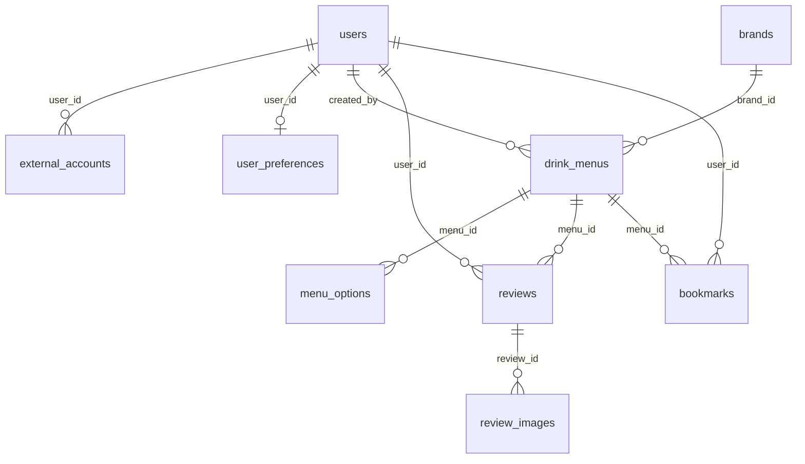

# 5단계. PostgreSQL DB 설계서

작성자: 7반 이민형 | 버전: 0.3.1 | 기준: 현재 프로젝트 기술서 초안_v2.md

## ERD 개요

9개 테이블을 유지한다. 사용자는 외부 계정과 현재 선호를 가지며, 브랜드별 메뉴와 추가 재료를 관리한다. 후기는 사용자와 메뉴를 연결하고 이미지가 속한다. 북마크는 사용자와 메뉴의 M:N 관계다. 대표 이미지가 삭제되면 메뉴 자체는 유지한다.



## Entity 요약

| Entity | PK | FK | 주요 컬럼 |
| --- | --- | --- | --- |
| users (사용자) | user_id |  | user_id, email, password_hash, display_name, role, created_at |
| external_accounts (외부 계정) | external_account_id | user_id → users.user_id | external_account_id, user_id, provider, provider_user_id, linked_at |
| user_preferences (사용자 선호) | user_id | user_id → users.user_id | user_id, preferred_categories, preferred_tastes, sweetness_preference, excluded_ingredients, challenge_level, updated_at |
| brands (브랜드) | brand_id |  | brand_id, name |
| drink_menus (괴식 메뉴) | menu_id | brand_id → brands.brand_id<br>created_by → users.user_id | menu_id, brand_id, created_by, name, base_drink, category, size, temperature, weirdness_level, recipe_description, representative_image_url, created_at |
| menu_options (메뉴 옵션) | option_id | menu_id → drink_menus.menu_id | option_id, menu_id, action, ingredient_name, quantity, unit |
| reviews (후기) | review_id | user_id → users.user_id<br>menu_id → drink_menus.menu_id | review_id, user_id, menu_id, rating, content, created_at |
| review_images (후기 이미지) | image_id | review_id → reviews.review_id | image_id, review_id, image_url, display_order |
| bookmarks (저장 목록) | user_id, menu_id | user_id → users.user_id<br>menu_id → drink_menus.menu_id | user_id, menu_id, saved_at |

## Entity Relationship Specification

| Parent Entity | Cardinality | Child Entity | FK Column | 비즈니스 규칙 |
| --- | --- | --- | --- | --- |
| users | 1 : 0..N | external_accounts | user_id | FK는 삭제 제한. 후기 이미지는 API에서 최대 5장 검사. |
| users | 1 : 0..1 | user_preferences | user_id | FK는 삭제 제한. 후기 이미지는 API에서 최대 5장 검사. |
| brands | 1 : 0..N | drink_menus | brand_id | FK는 삭제 제한. 후기 이미지는 API에서 최대 5장 검사. |
| users | 1 : 0..N | drink_menus | created_by | FK는 삭제 제한. 후기 이미지는 API에서 최대 5장 검사. |
| drink_menus | 1 : 0..N | menu_options | menu_id | FK는 삭제 제한. 후기 이미지는 API에서 최대 5장 검사. |
| users | 1 : 0..N | reviews | user_id | FK는 삭제 제한. 후기 이미지는 API에서 최대 5장 검사. |
| drink_menus | 1 : 0..N | reviews | menu_id | FK는 삭제 제한. 후기 이미지는 API에서 최대 5장 검사. |
| reviews | 1 : 0..5 | review_images | review_id | FK는 삭제 제한. 후기 이미지는 API에서 최대 5장 검사. |
| users | 1 : 0..N | bookmarks | user_id | FK는 삭제 제한. 후기 이미지는 API에서 최대 5장 검사. |
| drink_menus | 1 : 0..N | bookmarks | menu_id | FK는 삭제 제한. 후기 이미지는 API에서 최대 5장 검사. |

## Table Definition Specification

### users (사용자)

| Key | Column Name | Data Type | Nullable | Default | Description / Business Rule |
| --- | --- | --- | --- | --- | --- |
| PK | user_id | bigint | NO | IDENTITY | 사용자 식별자 |
|  | email | varchar(255) | NO | 없음 | 이메일. 서버에서 앞뒤 공백 제거와 소문자 정규화 |
|  | password_hash | varchar(255) | YES | 없음 | 구글 전용 계정은 NULL, 이메일 로그인 계정은 BCrypt 해시 |
|  | display_name | varchar(50) | NO | 없음 | 후기와 개인 페이지 표시 이름 |
|  | role | varchar(20) | NO | 'USER' | USER 또는 ADMIN, 가입 요청은 USER로 고정 |
|  | created_at | timestamptz | NO | CURRENT_TIMESTAMP | 가입 시각 |

| 구분 | 정의 |
| --- | --- |
| Primary Key | user_id |
| Foreign Key | 없음 |
| Unique Constraint | email |
| Index | PK 및 UNIQUE 인덱스 |
| Check Constraint | 추가하지 않음. 현재 v2에 따라 범위, 허용 값과 이미지 개수는 API에서 검증. |

### external_accounts (외부 계정)

| Key | Column Name | Data Type | Nullable | Default | Description / Business Rule |
| --- | --- | --- | --- | --- | --- |
| PK | external_account_id | bigint | NO | IDENTITY | 계정 연결 식별자 |
| FK | user_id | bigint | NO | 없음 | 연결된 사용자 |
|  | provider | varchar(20) | NO | 'GOOGLE' | 외부 인증 제공자 |
|  | provider_user_id | varchar(255) | NO | 없음 | 검증된 구글 sub |
|  | linked_at | timestamptz | NO | CURRENT_TIMESTAMP | 계정 연결 시각 |

| 구분 | 정의 |
| --- | --- |
| Primary Key | external_account_id |
| Foreign Key | user_id → users.user_id, RESTRICT |
| Unique Constraint | provider, provider_user_id<br>user_id, provider |
| Index | PK 및 UNIQUE 인덱스 |
| Check Constraint | 추가하지 않음. 현재 v2에 따라 범위, 허용 값과 이미지 개수는 API에서 검증. |

### user_preferences (사용자 선호)

| Key | Column Name | Data Type | Nullable | Default | Description / Business Rule |
| --- | --- | --- | --- | --- | --- |
| PK, FK | user_id | bigint | NO | 없음 | 사용자당 현재 설문 1건 |
|  | preferred_categories | jsonb | NO | 없음 | 커피, 스무디, 티 문자열 배열. 항목 검증은 서버 담당 |
|  | preferred_tastes | jsonb | NO | 없음 | 맛 선택값 또는 자유 입력의 문자열 배열 |
|  | sweetness_preference | varchar(50) | NO | 없음 | 선호 단맛 |
|  | excluded_ingredients | jsonb | NO | '[]'::jsonb | 제외 재료 문자열 배열, 해당 없음은 빈 배열 |
|  | challenge_level | varchar(20) | NO | 없음 | 초심자, 중급자, 상급자 |
|  | updated_at | timestamptz | NO | CURRENT_TIMESTAMP | 최초 생성과 재설문 시 서버가 갱신 |

| 구분 | 정의 |
| --- | --- |
| Primary Key | user_id |
| Foreign Key | user_id → users.user_id, RESTRICT |
| Unique Constraint | PK 외 없음 |
| Index | PK 및 UNIQUE 인덱스 |
| Check Constraint | 추가하지 않음. 현재 v2에 따라 범위, 허용 값과 이미지 개수는 API에서 검증. |

### brands (브랜드)

| Key | Column Name | Data Type | Nullable | Default | Description / Business Rule |
| --- | --- | --- | --- | --- | --- |
| PK | brand_id | bigint | NO | IDENTITY | 지점이 아닌 브랜드 식별자 |
|  | name | varchar(100) | NO | 없음 | 표준 브랜드명, 별칭은 서버에서 정규화 |

| 구분 | 정의 |
| --- | --- |
| Primary Key | brand_id |
| Foreign Key | 없음 |
| Unique Constraint | name |
| Index | PK 및 UNIQUE 인덱스 |
| Check Constraint | 추가하지 않음. 현재 v2에 따라 범위, 허용 값과 이미지 개수는 API에서 검증. |

### drink_menus (괴식 메뉴)

| Key | Column Name | Data Type | Nullable | Default | Description / Business Rule |
| --- | --- | --- | --- | --- | --- |
| PK | menu_id | bigint | NO | IDENTITY | 메뉴 식별자 |
| FK | brand_id | bigint | NO | 없음 | 주문 브랜드 |
| FK | created_by | bigint | NO | 없음 | 최초 등록자 |
|  | name | varchar(100) | NO | 없음 | 조합명, 이름 일치만으로 중복 판정하지 않음 |
|  | base_drink | varchar(100) | NO | 없음 | 기본 음료 |
|  | category | varchar(30) | NO | 없음 | 커피, 스무디, 티 |
|  | size | varchar(50) | YES | 없음 | 브랜드별 사이즈, NULL 비교 규칙 확인 필요 |
|  | temperature | varchar(30) | YES | 없음 | 온도, 표준값 확인 필요 |
|  | weirdness_level | varchar(20) | NO | 없음 | 초심자, 중급자, 상급자 |
|  | recipe_description | text | YES | 없음 | 추가 주문 설명 |
|  | representative_image_url | text | YES | 없음 | 새 메뉴 첫 후기의 첫 이미지. 해당 사진 삭제 시 NULL, 화면은 기본 이미지 표시 |
|  | created_at | timestamptz | NO | CURRENT_TIMESTAMP | 등록 시각과 최신순 정렬 |

| 구분 | 정의 |
| --- | --- |
| Primary Key | menu_id |
| Foreign Key | brand_id → brands.brand_id, RESTRICT<br>created_by → users.user_id, RESTRICT |
| Unique Constraint | PK 외 없음 |
| Index | idx_menus_brand: brand_id<br>idx_menus_category_created: category, created_at DESC, menu_id DESC<br>idx_menus_creator: created_by |
| Check Constraint | 추가하지 않음. 현재 v2에 따라 범위, 허용 값과 이미지 개수는 API에서 검증. |

### menu_options (메뉴 옵션)

| Key | Column Name | Data Type | Nullable | Default | Description / Business Rule |
| --- | --- | --- | --- | --- | --- |
| PK | option_id | bigint | NO | IDENTITY | 옵션 식별자 |
| FK | menu_id | bigint | NO | 없음 | 소속 메뉴 |
|  | action | varchar(20) | NO | 없음 | 현재는 추가만 사용, API에서 허용 값 검사 |
|  | ingredient_name | varchar(100) | NO | 없음 | 사용자가 입력한 추가 재료명 |
|  | quantity | numeric(10,2) | YES | 없음 | 수량이 있는 경우 필수, 정량 표현이 없으면 NULL 허용 |
|  | unit | varchar(30) | YES | 없음 | 수량 사용 시 필수, 정량 표현이 없으면 NULL 허용 |

| 구분 | 정의 |
| --- | --- |
| Primary Key | option_id |
| Foreign Key | menu_id → drink_menus.menu_id, RESTRICT |
| Unique Constraint | PK 외 없음 |
| Index | idx_options_menu: menu_id |
| Check Constraint | 추가하지 않음. 현재 v2에 따라 범위, 허용 값과 이미지 개수는 API에서 검증. |

### reviews (후기)

| Key | Column Name | Data Type | Nullable | Default | Description / Business Rule |
| --- | --- | --- | --- | --- | --- |
| PK | review_id | bigint | NO | IDENTITY | 후기 식별자 |
| FK | user_id | bigint | NO | 없음 | 작성자 |
| FK | menu_id | bigint | NO | 없음 | 대상 메뉴 |
|  | rating | smallint | NO | 없음 | 개인 평점 1~5, API에서 검증 |
|  | content | text | YES | 없음 | 선택 본문, 최대 2,000자 제안. 삭제 시 NULL |
|  | created_at | timestamptz | NO | CURRENT_TIMESTAMP | 작성 시각 |

| 구분 | 정의 |
| --- | --- |
| Primary Key | review_id |
| Foreign Key | user_id → users.user_id, RESTRICT<br>menu_id → drink_menus.menu_id, RESTRICT |
| Unique Constraint | PK 외 없음 |
| Index | idx_reviews_menu_user: menu_id, user_id<br>idx_reviews_user_created: user_id, created_at DESC, review_id DESC |
| Check Constraint | 추가하지 않음. 현재 v2에 따라 범위, 허용 값과 이미지 개수는 API에서 검증. |

### review_images (후기 이미지)

| Key | Column Name | Data Type | Nullable | Default | Description / Business Rule |
| --- | --- | --- | --- | --- | --- |
| PK | image_id | bigint | NO | IDENTITY | 이미지 식별자 |
| FK | review_id | bigint | NO | 없음 | 소속 후기 |
|  | image_url | text | NO | 없음 | 서버가 저장한 이미지 주소 |
|  | display_order | smallint | NO | 없음 | 업로드 순서, 1~5 |

| 구분 | 정의 |
| --- | --- |
| Primary Key | image_id |
| Foreign Key | review_id → reviews.review_id, RESTRICT |
| Unique Constraint | review_id, display_order |
| Index | PK 및 UNIQUE 인덱스 |
| Check Constraint | 추가하지 않음. 현재 v2에 따라 범위, 허용 값과 이미지 개수는 API에서 검증. |

### bookmarks (저장 목록)

| Key | Column Name | Data Type | Nullable | Default | Description / Business Rule |
| --- | --- | --- | --- | --- | --- |
| PK, FK | user_id | bigint | NO | 없음 | 저장 사용자 |
| PK, FK | menu_id | bigint | NO | 없음 | 저장 메뉴 |
|  | saved_at | timestamptz | NO | CURRENT_TIMESTAMP | 최신 저장순 기준 |

| 구분 | 정의 |
| --- | --- |
| Primary Key | user_id, menu_id |
| Foreign Key | user_id → users.user_id, RESTRICT<br>menu_id → drink_menus.menu_id, RESTRICT |
| Unique Constraint | PK 외 없음 |
| Index | idx_bookmarks_user_saved: user_id, saved_at DESC, menu_id DESC<br>idx_bookmarks_menu: menu_id |
| Check Constraint | 추가하지 않음. 현재 v2에 따라 범위, 허용 값과 이미지 개수는 API에서 검증. |

## 메뉴 평점과 삭제

사용자별 현재 후기의 평균을 먼저 구하고, 그 평균들을 다시 평균낸다. 후기가 남아 있지 않은 사용자는 집계에서 제외한다. 메뉴의 후기가 없으면 NULL로 반환하는 구현 제안이며 표시 자릿수는 [확인 필요]다.

```sql
SELECT menu_id, AVG(user_average) AS average_rating
FROM (
  SELECT menu_id, user_id, AVG(rating::numeric) AS user_average
  FROM reviews
  GROUP BY menu_id, user_id
) per_user
GROUP BY menu_id;
```

삭제는 작성자 확인 후 이미지 주소 수집 → 대표 이미지 일치 시 NULL 설정 → 이미지 행 삭제 → 후기 행 삭제 → 커밋 → 파일 정리 순서다. 메뉴 평점은 남은 후기에서 조회 시 계산한다. 메뉴와 다른 사용자의 후기는 유지한다. 다른 이미지로 자동 교체하지 않는다.

## LLM 동일 메뉴 판정과 등록

1. API가 필수값, 평점과 파일, 추가 재료를 검증한다.
2. 같은 브랜드의 기존 메뉴와 입력 조합을 서버가 구성해 LLM에 전달한다.
3. LLM이 기존 메뉴 ID 또는 null을 반환한다. 응답 파싱 및 비교 대상 ID 검증에 실패하면 저장하지 않는다.
4. 유효한 ID이면 후기와 이미지만 저장하고 기존 메뉴는 유지한다. 정상 null이면 새 메뉴와 옵션, 첫 후기, 이미지를 한 트랜잭션으로 저장한다.
5. DB 저장 직전에 기존 대상의 존재와 브랜드를 재확인한다. 영수증 인증은 현재 사용자와 브랜드의 일회성 상태이며 성공 시 소비한다.
6. 실패 시 임시 파일과 부분 저장을 정리한다. 같은 신규 조합의 동시 생성 방지는 후속 개선 과제이며 이번 설계에서 보장하지 않는다.

외부 LLM 호출 중에는 DB 트랜잭션을 길게 유지하지 않는다. 인증 상태의 중복 소비 방지와 DB 트랜잭션은 별개 책임이다. 응답 유실 시 자동 등록 재요청 대신 개인 페이지에서 결과를 확인한다.

## 검증 책임

API는 개인 평점 1~5, 이미지 최대 5장, 추가 action, 수량과 단위, 필수값과 JSON 배열 원소를 검증한다. DB는 PK, FK, UNIQUE와 NOT NULL로 관계와 유일성, 필수 저장값을 유지한다. API를 우회한 직접 DB 쓰기에도 동일한 검증이 필요하다.

수량이 없는 추가 옵션은 quantity=NULL을 허용한다. quantity가 있으면 양수와 단위를 요구한다. 기본 음료 전체 재료와 제외 또는 변경 전후 관계를 관리하지 않는다.

## AI 데이터 저장 여부

설문 응답은 user_preferences에 저장한다. 추천 요약과 답변, 동일 메뉴 판정 출력, 영수증 원본과 추출 결과는 영구 저장하지 않는다. 사용자가 입력한 추가 재료는 menu_options에 저장하고 추천에서 제외 조건과 비교한다. 기본 음료의 전체 성분은 사용자가 주문 시 확인하도록 화면에 안내한다.

## 확인 필요

관리자의 연결 데이터 삭제 정책, 영수증 임시 상태 유효 시간과 저장 방식, 파일 제한, 정량 표현 표준화, AI 모델과 동시 신규 메뉴 생성 방지는 확인 또는 후속 개선이 필요하다. SQL은 신규 스키마 생성용이며 기존 DB 마이그레이션으로 실행하지 않는다.
